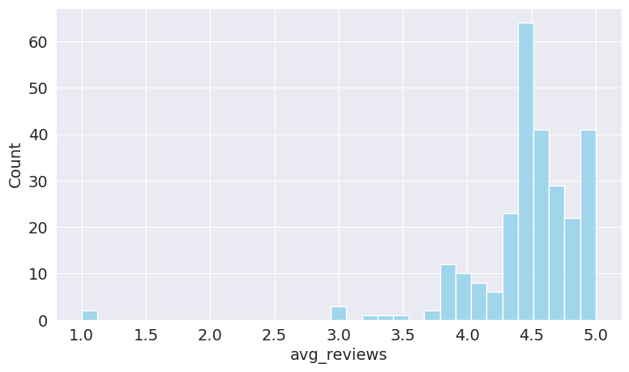

---
jupyter:
  colab:
  language_info:
    codemirror_mode:
      name: ipython
      version: 3
    file_extension: .py
    mimetype: text/x-python
    name: python
    nbconvert_exporter: python
    pygments_lexer: ipython3
    version: 3.8.5
  nbformat: 4
  nbformat_minor: 0
---

::: {.cell .markdown id="ZNFDCSFSa-xR"}
# AMAZON DATA SCEINCE BOOKS ANALYSIS

While Learning this course i got really interested in data science so
much so that i wanted to read a book. Buying a book from Amazon on a
particular topic is a hassle as it involves conflicting choices. So i
decided to create a project to analyse everything
:::

::: {.cell .markdown id="BdmWy2BCa-xS"}
## Downloading the Dataset

Using the opendatasets library we will download a kaggle dataset and
store it locally.
:::

::: {.cell .markdown id="DX_vgHPXa-xT"}
> Instructions for downloading the dataset (delete this cell)
>
> -   Find an interesting dataset on this page:
>     <https://www.kaggle.com/datasets?fileType=csv>
> -   The data should be in CSV format, and should contain at least 3
>     columns and 150 rows
> -   Download the dataset using the [`opendatasets` Python
>     library](https://github.com/JovianML/opendatasets#opendatasets)
:::

::: {.cell .code execution_count="1" executionInfo="{\"elapsed\":4864,\"status\":\"ok\",\"timestamp\":1681364241577,\"user\":{\"displayName\":\"Gaurav sharma\",\"userId\":\"03881896638130988318\"},\"user_tz\":-330}" id="uAc0deePa-xT"}
``` python
!pip install jovian opendatasets --upgrade --quiet
```
:::

::: {.cell .markdown id="Ao-Jmcvea-xU"}
Let\'s begin by downloading the data, and listing the files within the
dataset.
:::

::: {.cell .code execution_count="2" executionInfo="{\"elapsed\":14,\"status\":\"ok\",\"timestamp\":1681364241578,\"user\":{\"displayName\":\"Gaurav sharma\",\"userId\":\"03881896638130988318\"},\"user_tz\":-330}" id="5Uxm5MLLa-xV"}
``` python
# Change this
dataset_url = 'https://www.kaggle.com/datasets/die9origephit/amazon-data-science-books?select=final_book_dataset_kaggle2.csv' 
```
:::

::: {.cell .code execution_count="3" colab="{\"base_uri\":\"https://localhost:8080/\"}" executionInfo="{\"elapsed\":12,\"status\":\"ok\",\"timestamp\":1681364241578,\"user\":{\"displayName\":\"Gaurav sharma\",\"userId\":\"03881896638130988318\"},\"user_tz\":-330}" id="keA4Xtrya-xV" outputId="5fb8c2da-787d-4fe1-d7c1-fb894553865e"}
``` python
import opendatasets as od
od.download(dataset_url)
```

::: {.output .stream .stdout}
    Skipping, found downloaded files in "./amazon-data-science-books" (use force=True to force download)
:::
:::

::: {.cell .markdown id="aEVIbzEqa-xW"}
The dataset has been downloaded and extracted.
:::

::: {.cell .code execution_count="4" executionInfo="{\"elapsed\":8,\"status\":\"ok\",\"timestamp\":1681364241578,\"user\":{\"displayName\":\"Gaurav sharma\",\"userId\":\"03881896638130988318\"},\"user_tz\":-330}" id="WUY3akmfa-xX"}
``` python
# Change this
data_dir = './amazon-datascience-dataset'
```
:::

::: {.cell .code execution_count="5" colab="{\"base_uri\":\"https://localhost:8080/\"}" executionInfo="{\"elapsed\":8,\"status\":\"ok\",\"timestamp\":1681364241578,\"user\":{\"displayName\":\"Gaurav sharma\",\"userId\":\"03881896638130988318\"},\"user_tz\":-330}" id="1efQTN-ya-xX" outputId="5df9a3c1-7824-4c55-e032-eac3978d14d2"}
``` python
import os
try : 
  os.mkdir(data_dir)
except :
  FileExistsError : print('The file already exists')


os.listdir(data_dir)
```

::: {.output .stream .stdout}
    The file already exists
:::

::: {.output .execute_result execution_count="5"}
    []
:::
:::

::: {.cell .markdown id="w5ofgbZga-xX"}
Let us save and upload our work to Jovian before continuing.
:::

::: {.cell .code execution_count="6" executionInfo="{\"elapsed\":6,\"status\":\"ok\",\"timestamp\":1681364241579,\"user\":{\"displayName\":\"Gaurav sharma\",\"userId\":\"03881896638130988318\"},\"user_tz\":-330}" id="ZhLYTqNza-xX"}
``` python
project_name = "zerotopandas-course-project-starter" # change this (use lowercase letters and hyphens only)
```
:::

::: {.cell .code execution_count="7" executionInfo="{\"elapsed\":4078,\"status\":\"ok\",\"timestamp\":1681364245651,\"user\":{\"displayName\":\"Gaurav sharma\",\"userId\":\"03881896638130988318\"},\"user_tz\":-330}" id="ozEAk-Z6a-xY"}
``` python
!pip install jovian --upgrade -q
```
:::

::: {.cell .code execution_count="8" executionInfo="{\"elapsed\":1166,\"status\":\"ok\",\"timestamp\":1681364246814,\"user\":{\"displayName\":\"Gaurav sharma\",\"userId\":\"03881896638130988318\"},\"user_tz\":-330}" id="uW6p-2Fna-xY"}
``` python
import jovian
import pandas as pd
import numpy as np
import seaborn as sns
import matplotlib.pyplot as plt
```
:::

::: {.cell .code execution_count="9" colab="{\"base_uri\":\"https://localhost:8080/\"}" executionInfo="{\"elapsed\":21,\"status\":\"ok\",\"timestamp\":1681364246814,\"user\":{\"displayName\":\"Gaurav sharma\",\"userId\":\"03881896638130988318\"},\"user_tz\":-330}" id="eRAyPrDUa-xY" outputId="b293a30d-8873-4be5-f75f-901c53414bc8"}
``` python
jovian.commit(project=project_name)
```

::: {.output .stream .stdout}
    [jovian] Detected Colab notebook...
    [jovian] jovian.commit() is no longer required on Google Colab. If you ran this notebook from Jovian, 
    then just save this file in Colab using Ctrl+S/Cmd+S and it will be updated on Jovian. 
    Also, you can also delete this cell, it's no longer necessary.
:::
:::

::: {.cell .markdown id="Rzo2t2s5a-xY"}
## Data Preparation and Cleaning

Data Preparation and Cleaning is a crucial task, as the data may vary,
and because of those null values, the outcomes may also vary, giving us
an altered assumptions about the data
:::

::: {.cell .code execution_count="10" executionInfo="{\"elapsed\":18,\"status\":\"ok\",\"timestamp\":1681364246815,\"user\":{\"displayName\":\"Gaurav sharma\",\"userId\":\"03881896638130988318\"},\"user_tz\":-330}" id="G-b9uu5Ea-xa"}
``` python
bookdata = pd.read_csv("/content/amazon-data-science-books/final_book_dataset_kaggle2.csv")
```
:::

::: {.cell .markdown id="_iNA7-PXdZNo"}
# **Getting to know about the data set**
:::

::: {.cell .code execution_count="11" colab="{\"base_uri\":\"https://localhost:8080/\"}" executionInfo="{\"elapsed\":18,\"status\":\"ok\",\"timestamp\":1681364246815,\"user\":{\"displayName\":\"Gaurav sharma\",\"userId\":\"03881896638130988318\"},\"user_tz\":-330}" id="H7czHeBsa-xa" outputId="c1f63f3c-9a20-44f4-dbcd-04e00e63e73e"}
``` python
bookdata.info()
```

::: {.output .stream .stdout}
    <class 'pandas.core.frame.DataFrame'>
    RangeIndex: 830 entries, 0 to 829
    Data columns (total 19 columns):
     #   Column                        Non-Null Count  Dtype  
    ---  ------                        --------------  -----  
     0   title                         830 non-null    object 
     1   author                        657 non-null    object 
     2   price                         722 non-null    float64
     3   price (including used books)  722 non-null    object 
     4   pages                         745 non-null    object 
     5   avg_reviews                   702 non-null    float64
     6   n_reviews                     702 non-null    object 
     7   star5                         702 non-null    object 
     8   star4                         635 non-null    object 
     9   star3                         554 non-null    object 
     10  star2                         451 non-null    object 
     11  star1                         328 non-null    object 
     12  dimensions                    644 non-null    object 
     13  weight                        651 non-null    object 
     14  language                      759 non-null    object 
     15  publisher                     714 non-null    object 
     16  ISBN_13                       665 non-null    object 
     17  link                          830 non-null    object 
     18  complete_link                 830 non-null    object 
    dtypes: float64(2), object(17)
    memory usage: 123.3+ KB
:::
:::

::: {.cell .markdown id="GjMnbKtydngs"}
# **Sample of the dataframe**
:::

::: {.cell .code execution_count="12" colab="{\"base_uri\":\"https://localhost:8080/\",\"height\":1000}" executionInfo="{\"elapsed\":16,\"status\":\"ok\",\"timestamp\":1681364246815,\"user\":{\"displayName\":\"Gaurav sharma\",\"userId\":\"03881896638130988318\"},\"user_tz\":-330}" id="4UNmX9KXa-xa" outputId="fac2c115-2e7f-4654-f40f-84772632dba1"}
``` python
bookdata.sample(20)
```

::: {.output .execute_result execution_count="12"}
```{=html}

  <div id="df-b9956246-155e-458c-ab2e-ec14ffd599df">
    <div class="colab-df-container">
      <div>
<style scoped>
    .dataframe tbody tr th:only-of-type {
        vertical-align: middle;
    }

    .dataframe tbody tr th {
        vertical-align: top;
    }

    .dataframe thead th {
        text-align: right;
    }
</style>
<table border="1" class="dataframe">
  <thead>
    <tr style="text-align: right;">
      <th></th>
      <th>title</th>
      <th>author</th>
      <th>price</th>
      <th>price (including used books)</th>
      <th>pages</th>
      <th>avg_reviews</th>
      <th>n_reviews</th>
      <th>star5</th>
      <th>star4</th>
      <th>star3</th>
      <th>star2</th>
      <th>star1</th>
      <th>dimensions</th>
      <th>weight</th>
      <th>language</th>
      <th>publisher</th>
      <th>ISBN_13</th>
      <th>link</th>
      <th>complete_link</th>
    </tr>
  </thead>
  <tbody>
    <tr>
      <th>108</th>
      <td>Everyday Adventures with Unruly Data</td>
      <td>[ Melanie Feinberg]</td>
      <td>35.00</td>
      <td>35</td>
      <td>336</td>
      <td>NaN</td>
      <td>NaN</td>
      <td>NaN</td>
      <td>NaN</td>
      <td>NaN</td>
      <td>NaN</td>
      <td>NaN</td>
      <td>6 x 0.85 x 9 inches</td>
      <td>14.4 ounces</td>
      <td>English</td>
      <td>The MIT Press (October 11, 2022)</td>
      <td>978-0262544405</td>
      <td>/Everyday-Adventures-Unruly-Melanie-Feinberg/d...</td>
      <td>https://www.amazon.com/Everyday-Adventures-Unr...</td>
    </tr>
    <tr>
      <th>682</th>
      <td>Building Data Science Applications with FastAP...</td>
      <td>[ François Voron]</td>
      <td>31.49</td>
      <td>31.49</td>
      <td>426</td>
      <td>4.4</td>
      <td>29</td>
      <td>69%</td>
      <td>6%</td>
      <td>19%</td>
      <td>6%</td>
      <td>NaN</td>
      <td>NaN</td>
      <td>NaN</td>
      <td>English</td>
      <td>Packt Publishing; 1st edition (October 8, 2021)</td>
      <td>NaN</td>
      <td>/Building-Data-Science-Applications-FastAPI-eb...</td>
      <td>https://www.amazon.com/Building-Data-Science-A...</td>
    </tr>
    <tr>
      <th>553</th>
      <td>Modeling and Simulation in Python</td>
      <td>[ Allen B. Downey]</td>
      <td>39.99</td>
      <td>39.99</td>
      <td>272</td>
      <td>NaN</td>
      <td>NaN</td>
      <td>NaN</td>
      <td>NaN</td>
      <td>NaN</td>
      <td>NaN</td>
      <td>NaN</td>
      <td>0.04 x 0.04 x 0.04 inches</td>
      <td>13 ounces</td>
      <td>English</td>
      <td>No Starch Press (May 30, 2023)</td>
      <td>978-1718502161</td>
      <td>/Modeling-Simulation-Python-Allen-Downey/dp/17...</td>
      <td>https://www.amazon.com/Modeling-Simulation-Pyt...</td>
    </tr>
    <tr>
      <th>804</th>
      <td>Essential Calculus Skills Practice Workbook wi...</td>
      <td>[ Chris McMullen]</td>
      <td>9.99</td>
      <td>9.99</td>
      <td>151</td>
      <td>4.6</td>
      <td>1,537</td>
      <td>74%</td>
      <td>16%</td>
      <td>7%</td>
      <td>1%</td>
      <td>2%</td>
      <td>8 x 0.35 x 10 inches</td>
      <td>11 ounces</td>
      <td>English</td>
      <td>Zishka Publishing (August 16, 2018)</td>
      <td>978-1941691243</td>
      <td>/gp/slredirect/picassoRedirect.html/ref=pa_sp_...</td>
      <td>https://www.amazon.com/gp/slredirect/picassoRe...</td>
    </tr>
    <tr>
      <th>48</th>
      <td>An Introduction to Statistics and Data Analysi...</td>
      <td>[ Lisa Daniels,  and , Nicholas W. Minot]</td>
      <td>75.24</td>
      <td>24.50 - 75.24</td>
      <td>392</td>
      <td>4.6</td>
      <td>32</td>
      <td>69%</td>
      <td>22%</td>
      <td>9%</td>
      <td>NaN</td>
      <td>NaN</td>
      <td>7.38 x 0.89 x 9.13 inches</td>
      <td>1.52 pounds</td>
      <td>English</td>
      <td>SAGE Publications, Inc; 1st edition (January 2...</td>
      <td>978-1506371832</td>
      <td>/Introduction-Statistics-Analysis-Using-Stata%...</td>
      <td>https://www.amazon.com/Introduction-Statistics...</td>
    </tr>
    <tr>
      <th>574</th>
      <td>Real-World Python: A Hacker's Guide to Solving...</td>
      <td>[ Lee Vaughan]</td>
      <td>34.95</td>
      <td>21.75 - 34.95</td>
      <td>360</td>
      <td>4.7</td>
      <td>96</td>
      <td>79%</td>
      <td>15%</td>
      <td>2%</td>
      <td>2%</td>
      <td>1%</td>
      <td>7 x 0.93 x 9.25 inches</td>
      <td>1.5 pounds</td>
      <td>English</td>
      <td>No Starch Press (November 5, 2020)</td>
      <td></td>
      <td>/Real-World-Python-Hackers-Solving-Problems/dp...</td>
      <td>https://www.amazon.com/Real-World-Python-Hacke...</td>
    </tr>
    <tr>
      <th>31</th>
      <td>Coding Games in Python (Computer Coding for Kids)</td>
      <td>[ DK]</td>
      <td>13.99</td>
      <td>13.99</td>
      <td>224</td>
      <td>4.5</td>
      <td>274</td>
      <td>70%</td>
      <td>17%</td>
      <td>6%</td>
      <td>4%</td>
      <td>4%</td>
      <td>7.75 x 0.63 x 9.19 inches</td>
      <td>1.54 pounds</td>
      <td>English</td>
      <td>DK Children; Illustrated edition (July 3, 2018)</td>
      <td>$13.99</td>
      <td>/Coding-Games-Python-DK/dp/1465473610/ref=sr_1...</td>
      <td>https://www.amazon.com/Coding-Games-Python-DK/...</td>
    </tr>
    <tr>
      <th>179</th>
      <td>The Definitive Guide to DAX: Business Intellig...</td>
      <td>NaN</td>
      <td>43.99</td>
      <td>42.11 - 43.99</td>
      <td>768</td>
      <td>4.7</td>
      <td>1,155</td>
      <td>83%</td>
      <td>12%</td>
      <td>3%</td>
      <td>1%</td>
      <td>1%</td>
      <td>7.38 x 1.73 x 9.13 inches</td>
      <td>3 pounds</td>
      <td>English</td>
      <td>Microsoft Press; 2nd edition (July 2, 2019)</td>
      <td>978-1509306978</td>
      <td>/Definitive-Guide-DAX-intelligence-Microsoft/d...</td>
      <td>https://www.amazon.com/Definitive-Guide-DAX-in...</td>
    </tr>
    <tr>
      <th>324</th>
      <td>Hypothesis Testing: An Intuitive Guide for Mak...</td>
      <td>[ Jim Frost]</td>
      <td>23.74</td>
      <td>23.74</td>
      <td>381</td>
      <td>4.5</td>
      <td>112</td>
      <td>77%</td>
      <td>13%</td>
      <td>3%</td>
      <td>2%</td>
      <td>5%</td>
      <td>6 x 0.86 x 9 inches</td>
      <td>1.12 pounds</td>
      <td>English</td>
      <td>Statistics By Jim Publishing (September 14, 2020)</td>
      <td>978-1735431154</td>
      <td>/Hypothesis-Testing-Intuitive-Making-Decisions...</td>
      <td>https://www.amazon.com/Hypothesis-Testing-Intu...</td>
    </tr>
    <tr>
      <th>462</th>
      <td>Python Programming for Beginners: An Introduct...</td>
      <td>[ Jason Cannon]</td>
      <td>NaN</td>
      <td>NaN</td>
      <td>164</td>
      <td>4.5</td>
      <td>1,001</td>
      <td>72%</td>
      <td>15%</td>
      <td>8%</td>
      <td>3%</td>
      <td>2%</td>
      <td>NaN</td>
      <td>NaN</td>
      <td>English</td>
      <td>NaN</td>
      <td>NaN</td>
      <td>/Python-Programming-Beginners-Introduction-Com...</td>
      <td>https://www.amazon.com/Python-Programming-Begi...</td>
    </tr>
    <tr>
      <th>70</th>
      <td>Spectrum Grades 6-8 Data Analysis &amp; Probabilit...</td>
      <td>NaN</td>
      <td>25.00</td>
      <td>25</td>
      <td>128</td>
      <td>4.6</td>
      <td>142</td>
      <td>76%</td>
      <td>13%</td>
      <td>6%</td>
      <td>2%</td>
      <td>3%</td>
      <td>8.38 x 0.31 x 10.88 inches</td>
      <td>9.9 ounces</td>
      <td>English</td>
      <td>Spectrum; Workbook edition (February 25, 2015)</td>
      <td>978-1483816630</td>
      <td>/Probability-Workbook-6th-8th-Calculating-Stat...</td>
      <td>https://www.amazon.com/Probability-Workbook-6t...</td>
    </tr>
    <tr>
      <th>589</th>
      <td>Learn More Python 3 the Hard Way: The Next Ste...</td>
      <td>NaN</td>
      <td>28.56</td>
      <td>22.85 - 28.56</td>
      <td>240</td>
      <td>4.6</td>
      <td>106</td>
      <td>78%</td>
      <td>13%</td>
      <td>4%</td>
      <td>2%</td>
      <td>3%</td>
      <td>6.9 x 0.6 x 9 inches</td>
      <td>13.8 ounces</td>
      <td>English</td>
      <td>Addison-Wesley Professional; 1st edition (Sept...</td>
      <td>978-0134123486</td>
      <td>/Learn-More-Python-Hard-Way/dp/0134123484/ref=...</td>
      <td>https://www.amazon.com/Learn-More-Python-Hard-...</td>
    </tr>
    <tr>
      <th>394</th>
      <td>Python: - The Bible- 3 Manuscripts in 1 book: ...</td>
      <td>NaN</td>
      <td>27.97</td>
      <td>27.97</td>
      <td>375</td>
      <td>4.3</td>
      <td>4,228</td>
      <td>64%</td>
      <td>16%</td>
      <td>10%</td>
      <td>4%</td>
      <td>6%</td>
      <td>6 x 0.85 x 9 inches</td>
      <td>1.11 pounds</td>
      <td>English</td>
      <td>Independently published (April 28, 2018)</td>
      <td>978-1980953906</td>
      <td>/gp/slredirect/picassoRedirect.html/ref=pa_sp_...</td>
      <td>https://www.amazon.com/gp/slredirect/picassoRe...</td>
    </tr>
    <tr>
      <th>30</th>
      <td>Preparing For A Data Interview: Learn Enough P...</td>
      <td>[ Jonelle Hoop]</td>
      <td>10.74</td>
      <td>10.74</td>
      <td>24</td>
      <td>NaN</td>
      <td>NaN</td>
      <td>NaN</td>
      <td>NaN</td>
      <td>NaN</td>
      <td>NaN</td>
      <td>NaN</td>
      <td>6 x 0.06 x 9 inches</td>
      <td>3.04 ounces</td>
      <td>English</td>
      <td>Independently published (December 10, 2022)</td>
      <td>979-8367888348</td>
      <td>/Preparing-Data-Interview-Enough-Project/dp/B0...</td>
      <td>https://www.amazon.com/Preparing-Data-Intervie...</td>
    </tr>
    <tr>
      <th>246</th>
      <td>System Design Interview: The Ultimate Guide to...</td>
      <td>[ Liam DeSantis]</td>
      <td>23.99</td>
      <td>23.99</td>
      <td>114</td>
      <td>4.9</td>
      <td>254</td>
      <td>93%</td>
      <td>7%</td>
      <td>NaN</td>
      <td>NaN</td>
      <td>NaN</td>
      <td>7 x 0.26 x 10 inches</td>
      <td>9.9 ounces</td>
      <td>English</td>
      <td>Independently published (November 30, 2022)</td>
      <td>979-8366393140</td>
      <td>/gp/slredirect/picassoRedirect.html/ref=pa_sp_...</td>
      <td>https://www.amazon.com/gp/slredirect/picassoRe...</td>
    </tr>
    <tr>
      <th>789</th>
      <td>Google BigQuery: The Definitive Guide: Data Wa...</td>
      <td>[ Valliappa Lakshmanan,  and , Jordan Tigani]</td>
      <td>29.99</td>
      <td>29.99</td>
      <td>522</td>
      <td>4.5</td>
      <td>105</td>
      <td>71%</td>
      <td>19%</td>
      <td>5%</td>
      <td>3%</td>
      <td>2%</td>
      <td>7.01 x 1 x 9.17 inches</td>
      <td>1.81 pounds</td>
      <td>English</td>
      <td>O'Reilly Media; 1st edition (November 19, 2019)</td>
      <td></td>
      <td>/Google-BigQuery-Definitive-Warehousing-Analyt...</td>
      <td>https://www.amazon.com/Google-BigQuery-Definit...</td>
    </tr>
    <tr>
      <th>174</th>
      <td>Microsoft Office 365 for Beginners: 12 Books I...</td>
      <td>[ Jamie Keet]</td>
      <td>12.99</td>
      <td>12.99</td>
      <td>300</td>
      <td>4.9</td>
      <td>410</td>
      <td>97%</td>
      <td>3%</td>
      <td>1%</td>
      <td>NaN</td>
      <td>NaN</td>
      <td>8.5 x 0.68 x 11 inches</td>
      <td>1.9 pounds</td>
      <td>English</td>
      <td>;</td>
      <td></td>
      <td>/gp/slredirect/picassoRedirect.html/ref=pa_sp_...</td>
      <td>https://www.amazon.com/gp/slredirect/picassoRe...</td>
    </tr>
    <tr>
      <th>45</th>
      <td>Dyadic Data Analysis (Methodology in the Socia...</td>
      <td>NaN</td>
      <td>55.32</td>
      <td>50.99 - 55.32</td>
      <td>458</td>
      <td>4.4</td>
      <td>24</td>
      <td>73%</td>
      <td>12%</td>
      <td>7%</td>
      <td>7%</td>
      <td>NaN</td>
      <td>6 x 0.94 x 9 inches</td>
      <td>1.45 pounds</td>
      <td>English</td>
      <td>The Guilford Press; 1st edition (November 26, ...</td>
      <td>978-1462546138</td>
      <td>/Dyadic-Analysis-Methodology-Social-Sciences/d...</td>
      <td>https://www.amazon.com/Dyadic-Analysis-Methodo...</td>
    </tr>
    <tr>
      <th>386</th>
      <td>2Pack Reptile Plants Hanging Silk Terrarium Pl...</td>
      <td>NaN</td>
      <td>NaN</td>
      <td>NaN</td>
      <td>NaN</td>
      <td>4.4</td>
      <td>701</td>
      <td>68%</td>
      <td>15%</td>
      <td>9%</td>
      <td>4%</td>
      <td>3%</td>
      <td>NaN</td>
      <td>NaN</td>
      <td>NaN</td>
      <td>NaN</td>
      <td>NaN</td>
      <td>/Reptile-Hanging-Terrarium-Suction-Decorations...</td>
      <td>https://www.amazon.com/Reptile-Hanging-Terrari...</td>
    </tr>
    <tr>
      <th>632</th>
      <td>Dead Simple Python: Idiomatic Python for the I...</td>
      <td>[ Jason C McDonald]</td>
      <td>28.99</td>
      <td>28.99</td>
      <td>705</td>
      <td>NaN</td>
      <td>NaN</td>
      <td>NaN</td>
      <td>NaN</td>
      <td>NaN</td>
      <td>NaN</td>
      <td>NaN</td>
      <td>NaN</td>
      <td>NaN</td>
      <td>English</td>
      <td>No Starch Press (November 22, 2022)</td>
      <td>NaN</td>
      <td>/Dead-Simple-Python-Idiomatic-Programmers-eboo...</td>
      <td>https://www.amazon.com/Dead-Simple-Python-Idio...</td>
    </tr>
  </tbody>
</table>
</div>
      <button class="colab-df-convert" onclick="convertToInteractive('df-b9956246-155e-458c-ab2e-ec14ffd599df')"
              title="Convert this dataframe to an interactive table."
              style="display:none;">
        
  <svg xmlns="http://www.w3.org/2000/svg" height="24px"viewBox="0 0 24 24"
       width="24px">
    <path d="M0 0h24v24H0V0z" fill="none"/>
    <path d="M18.56 5.44l.94 2.06.94-2.06 2.06-.94-2.06-.94-.94-2.06-.94 2.06-2.06.94zm-11 1L8.5 8.5l.94-2.06 2.06-.94-2.06-.94L8.5 2.5l-.94 2.06-2.06.94zm10 10l.94 2.06.94-2.06 2.06-.94-2.06-.94-.94-2.06-.94 2.06-2.06.94z"/><path d="M17.41 7.96l-1.37-1.37c-.4-.4-.92-.59-1.43-.59-.52 0-1.04.2-1.43.59L10.3 9.45l-7.72 7.72c-.78.78-.78 2.05 0 2.83L4 21.41c.39.39.9.59 1.41.59.51 0 1.02-.2 1.41-.59l7.78-7.78 2.81-2.81c.8-.78.8-2.07 0-2.86zM5.41 20L4 18.59l7.72-7.72 1.47 1.35L5.41 20z"/>
  </svg>
      </button>
      
  <style>
    .colab-df-container {
      display:flex;
      flex-wrap:wrap;
      gap: 12px;
    }

    .colab-df-convert {
      background-color: #E8F0FE;
      border: none;
      border-radius: 50%;
      cursor: pointer;
      display: none;
      fill: #1967D2;
      height: 32px;
      padding: 0 0 0 0;
      width: 32px;
    }

    .colab-df-convert:hover {
      background-color: #E2EBFA;
      box-shadow: 0px 1px 2px rgba(60, 64, 67, 0.3), 0px 1px 3px 1px rgba(60, 64, 67, 0.15);
      fill: #174EA6;
    }

    [theme=dark] .colab-df-convert {
      background-color: #3B4455;
      fill: #D2E3FC;
    }

    [theme=dark] .colab-df-convert:hover {
      background-color: #434B5C;
      box-shadow: 0px 1px 3px 1px rgba(0, 0, 0, 0.15);
      filter: drop-shadow(0px 1px 2px rgba(0, 0, 0, 0.3));
      fill: #FFFFFF;
    }
  </style>

      <script>
        const buttonEl =
          document.querySelector('#df-b9956246-155e-458c-ab2e-ec14ffd599df button.colab-df-convert');
        buttonEl.style.display =
          google.colab.kernel.accessAllowed ? 'block' : 'none';

        async function convertToInteractive(key) {
          const element = document.querySelector('#df-b9956246-155e-458c-ab2e-ec14ffd599df');
          const dataTable =
            await google.colab.kernel.invokeFunction('convertToInteractive',
                                                     [key], {});
          if (!dataTable) return;

          const docLinkHtml = 'Like what you see? Visit the ' +
            '<a target="_blank" href=https://colab.research.google.com/notebooks/data_table.ipynb>data table notebook</a>'
            + ' to learn more about interactive tables.';
          element.innerHTML = '';
          dataTable['output_type'] = 'display_data';
          await google.colab.output.renderOutput(dataTable, element);
          const docLink = document.createElement('div');
          docLink.innerHTML = docLinkHtml;
          element.appendChild(docLink);
        }
      </script>
    </div>
  </div>
  
```
:::
:::

::: {.cell .code execution_count="13" executionInfo="{\"elapsed\":16,\"status\":\"ok\",\"timestamp\":1681364246816,\"user\":{\"displayName\":\"Gaurav sharma\",\"userId\":\"03881896638130988318\"},\"user_tz\":-330}" id="Z4dVC4pKa-xa"}
``` python
bookdata2  = bookdata.copy()
```
:::

::: {.cell .code execution_count="14" colab="{\"base_uri\":\"https://localhost:8080/\"}" executionInfo="{\"elapsed\":16,\"status\":\"ok\",\"timestamp\":1681364246816,\"user\":{\"displayName\":\"Gaurav sharma\",\"userId\":\"03881896638130988318\"},\"user_tz\":-330}" id="Yd6rUf10vK_u" outputId="fbe706b6-0d78-4c94-d7ab-558c8ce6712d"}
``` python
bookdata2.info()
```

::: {.output .stream .stdout}
    <class 'pandas.core.frame.DataFrame'>
    RangeIndex: 830 entries, 0 to 829
    Data columns (total 19 columns):
     #   Column                        Non-Null Count  Dtype  
    ---  ------                        --------------  -----  
     0   title                         830 non-null    object 
     1   author                        657 non-null    object 
     2   price                         722 non-null    float64
     3   price (including used books)  722 non-null    object 
     4   pages                         745 non-null    object 
     5   avg_reviews                   702 non-null    float64
     6   n_reviews                     702 non-null    object 
     7   star5                         702 non-null    object 
     8   star4                         635 non-null    object 
     9   star3                         554 non-null    object 
     10  star2                         451 non-null    object 
     11  star1                         328 non-null    object 
     12  dimensions                    644 non-null    object 
     13  weight                        651 non-null    object 
     14  language                      759 non-null    object 
     15  publisher                     714 non-null    object 
     16  ISBN_13                       665 non-null    object 
     17  link                          830 non-null    object 
     18  complete_link                 830 non-null    object 
    dtypes: float64(2), object(17)
    memory usage: 123.3+ KB
:::
:::

::: {.cell .code execution_count="15" colab="{\"base_uri\":\"https://localhost:8080/\",\"height\":300}" executionInfo="{\"elapsed\":14,\"status\":\"ok\",\"timestamp\":1681364246816,\"user\":{\"displayName\":\"Gaurav sharma\",\"userId\":\"03881896638130988318\"},\"user_tz\":-330}" id="Mw-_bsHynfMh" outputId="2278bd3e-5865-4938-eed2-350799050774"}
``` python
bookdata2.describe()
```

::: {.output .execute_result execution_count="15"}
```{=html}

  <div id="df-c242c5e2-0cac-451e-a22b-50993cfb5cde">
    <div class="colab-df-container">
      <div>
<style scoped>
    .dataframe tbody tr th:only-of-type {
        vertical-align: middle;
    }

    .dataframe tbody tr th {
        vertical-align: top;
    }

    .dataframe thead th {
        text-align: right;
    }
</style>
<table border="1" class="dataframe">
  <thead>
    <tr style="text-align: right;">
      <th></th>
      <th>price</th>
      <th>avg_reviews</th>
    </tr>
  </thead>
  <tbody>
    <tr>
      <th>count</th>
      <td>722.000000</td>
      <td>702.000000</td>
    </tr>
    <tr>
      <th>mean</th>
      <td>46.491537</td>
      <td>4.472080</td>
    </tr>
    <tr>
      <th>std</th>
      <td>63.292394</td>
      <td>0.409608</td>
    </tr>
    <tr>
      <th>min</th>
      <td>0.990000</td>
      <td>1.000000</td>
    </tr>
    <tr>
      <th>25%</th>
      <td>23.725000</td>
      <td>4.325000</td>
    </tr>
    <tr>
      <th>50%</th>
      <td>39.490000</td>
      <td>4.500000</td>
    </tr>
    <tr>
      <th>75%</th>
      <td>51.990000</td>
      <td>4.700000</td>
    </tr>
    <tr>
      <th>max</th>
      <td>1318.740000</td>
      <td>5.000000</td>
    </tr>
  </tbody>
</table>
</div>
      <button class="colab-df-convert" onclick="convertToInteractive('df-c242c5e2-0cac-451e-a22b-50993cfb5cde')"
              title="Convert this dataframe to an interactive table."
              style="display:none;">
        
  <svg xmlns="http://www.w3.org/2000/svg" height="24px"viewBox="0 0 24 24"
       width="24px">
    <path d="M0 0h24v24H0V0z" fill="none"/>
    <path d="M18.56 5.44l.94 2.06.94-2.06 2.06-.94-2.06-.94-.94-2.06-.94 2.06-2.06.94zm-11 1L8.5 8.5l.94-2.06 2.06-.94-2.06-.94L8.5 2.5l-.94 2.06-2.06.94zm10 10l.94 2.06.94-2.06 2.06-.94-2.06-.94-.94-2.06-.94 2.06-2.06.94z"/><path d="M17.41 7.96l-1.37-1.37c-.4-.4-.92-.59-1.43-.59-.52 0-1.04.2-1.43.59L10.3 9.45l-7.72 7.72c-.78.78-.78 2.05 0 2.83L4 21.41c.39.39.9.59 1.41.59.51 0 1.02-.2 1.41-.59l7.78-7.78 2.81-2.81c.8-.78.8-2.07 0-2.86zM5.41 20L4 18.59l7.72-7.72 1.47 1.35L5.41 20z"/>
  </svg>
      </button>
      
  <style>
    .colab-df-container {
      display:flex;
      flex-wrap:wrap;
      gap: 12px;
    }

    .colab-df-convert {
      background-color: #E8F0FE;
      border: none;
      border-radius: 50%;
      cursor: pointer;
      display: none;
      fill: #1967D2;
      height: 32px;
      padding: 0 0 0 0;
      width: 32px;
    }

    .colab-df-convert:hover {
      background-color: #E2EBFA;
      box-shadow: 0px 1px 2px rgba(60, 64, 67, 0.3), 0px 1px 3px 1px rgba(60, 64, 67, 0.15);
      fill: #174EA6;
    }

    [theme=dark] .colab-df-convert {
      background-color: #3B4455;
      fill: #D2E3FC;
    }

    [theme=dark] .colab-df-convert:hover {
      background-color: #434B5C;
      box-shadow: 0px 1px 3px 1px rgba(0, 0, 0, 0.15);
      filter: drop-shadow(0px 1px 2px rgba(0, 0, 0, 0.3));
      fill: #FFFFFF;
    }
  </style>

      <script>
        const buttonEl =
          document.querySelector('#df-c242c5e2-0cac-451e-a22b-50993cfb5cde button.colab-df-convert');
        buttonEl.style.display =
          google.colab.kernel.accessAllowed ? 'block' : 'none';

        async function convertToInteractive(key) {
          const element = document.querySelector('#df-c242c5e2-0cac-451e-a22b-50993cfb5cde');
          const dataTable =
            await google.colab.kernel.invokeFunction('convertToInteractive',
                                                     [key], {});
          if (!dataTable) return;

          const docLinkHtml = 'Like what you see? Visit the ' +
            '<a target="_blank" href=https://colab.research.google.com/notebooks/data_table.ipynb>data table notebook</a>'
            + ' to learn more about interactive tables.';
          element.innerHTML = '';
          dataTable['output_type'] = 'display_data';
          await google.colab.output.renderOutput(dataTable, element);
          const docLink = document.createElement('div');
          docLink.innerHTML = docLinkHtml;
          element.appendChild(docLink);
        }
      </script>
    </div>
  </div>
  
```
:::
:::

::: {.cell .markdown id="op6jgCXQnjHU"}
**changing values to numeric**
:::

::: {.cell .code execution_count="16" executionInfo="{\"elapsed\":14,\"status\":\"ok\",\"timestamp\":1681364246817,\"user\":{\"displayName\":\"Gaurav sharma\",\"userId\":\"03881896638130988318\"},\"user_tz\":-330}" id="p1aAFMUEnpSl"}
``` python
bookdata2['pages'] = pd.to_numeric(bookdata2['pages'], errors = 'coerce')
bookdata2['price (including used books)'] = pd.to_numeric(bookdata2['price (including used books)'], errors = 'coerce')
bookdata2['n_reviews'] = pd.to_numeric(bookdata2['n_reviews'], errors = 'coerce')
bookdata2['weight'] = bookdata2['n_reviews'].map(str)
```
:::

::: {.cell .code execution_count="17" executionInfo="{\"elapsed\":14,\"status\":\"ok\",\"timestamp\":1681364246817,\"user\":{\"displayName\":\"Gaurav sharma\",\"userId\":\"03881896638130988318\"},\"user_tz\":-330}" id="UjEPoMbApWeL"}
``` python
bookdata2.drop(bookdata2[bookdata2['price (including used books)'] < 10].index, inplace = True)
```
:::

::: {.cell .markdown id="R2cb4JPYeyKW"}
# **DATA PREPROCESSING AND CLEANING**

If we check the row 16 in this dataset, the book is \"MONTY PYTHON AND
THE HOLY GRAIL\"

which is not a book that teaches python but it\'s a comic book authored
by Monty Python hence we need to drop such rows
:::

::: {.cell .code execution_count="18" colab="{\"base_uri\":\"https://localhost:8080/\"}" executionInfo="{\"elapsed\":14,\"status\":\"ok\",\"timestamp\":1681364246817,\"user\":{\"displayName\":\"Gaurav sharma\",\"userId\":\"03881896638130988318\"},\"user_tz\":-330}" id="S6BGxoYxa-xb" outputId="4af3c6a5-edaa-49b5-ecb2-b531124503ca"}
``` python
bookdata2.info()
```

::: {.output .stream .stdout}
    <class 'pandas.core.frame.DataFrame'>
    Int64Index: 787 entries, 1 to 829
    Data columns (total 19 columns):
     #   Column                        Non-Null Count  Dtype  
    ---  ------                        --------------  -----  
     0   title                         787 non-null    object 
     1   author                        628 non-null    object 
     2   price                         679 non-null    float64
     3   price (including used books)  418 non-null    float64
     4   pages                         701 non-null    float64
     5   avg_reviews                   665 non-null    float64
     6   n_reviews                     627 non-null    float64
     7   star5                         665 non-null    object 
     8   star4                         604 non-null    object 
     9   star3                         523 non-null    object 
     10  star2                         425 non-null    object 
     11  star1                         307 non-null    object 
     12  dimensions                    614 non-null    object 
     13  weight                        787 non-null    object 
     14  language                      718 non-null    object 
     15  publisher                     680 non-null    object 
     16  ISBN_13                       640 non-null    object 
     17  link                          787 non-null    object 
     18  complete_link                 787 non-null    object 
    dtypes: float64(5), object(14)
    memory usage: 123.0+ KB
:::
:::

::: {.cell .markdown id="-wtDObfujgBZ"}
**To see how many percentage of the data is actually null column wise**
:::

::: {.cell .code execution_count="19" colab="{\"base_uri\":\"https://localhost:8080/\"}" executionInfo="{\"elapsed\":11,\"status\":\"ok\",\"timestamp\":1681364246817,\"user\":{\"displayName\":\"Gaurav sharma\",\"userId\":\"03881896638130988318\"},\"user_tz\":-330}" id="JLpeghqwjmYs" outputId="95fcacd4-d826-43fa-8878-5c22830beb16"}
``` python
null_var = bookdata.isnull().sum()/bookdata.shape[0] * 100
null_var
```

::: {.output .execute_result execution_count="19"}
    title                            0.000000
    author                          20.843373
    price                           13.012048
    price (including used books)    13.012048
    pages                           10.240964
    avg_reviews                     15.421687
    n_reviews                       15.421687
    star5                           15.421687
    star4                           23.493976
    star3                           33.253012
    star2                           45.662651
    star1                           60.481928
    dimensions                      22.409639
    weight                          21.566265
    language                         8.554217
    publisher                       13.975904
    ISBN_13                         19.879518
    link                             0.000000
    complete_link                    0.000000
    dtype: float64
:::
:::

::: {.cell .markdown id="I9oMskCZgKIU"}
**we can see that these types of books have mostly all attributes set to
NaN**
:::

::: {.cell .markdown id="wSQXpJ4IhPwN"}
***The most efficient startegy and the ideation to fix and handle all
the missing values is to make a heatmap of it and then curating it in
such a way that you see a clear heatmap with no whitelines of NaN
values***
:::

::: {.cell .code execution_count="20" colab="{\"base_uri\":\"https://localhost:8080/\",\"height\":1000}" executionInfo="{\"elapsed\":3474,\"status\":\"ok\",\"timestamp\":1681364250283,\"user\":{\"displayName\":\"Gaurav sharma\",\"userId\":\"03881896638130988318\"},\"user_tz\":-330}" id="Dk5XFZhEa-xb" outputId="79cdefa3-3a7d-42b8-d12c-f0ce9f19f7fe"}
``` python
plt.figure(figsize = (25,25))
sns.heatmap(bookdata2.isnull())
```

::: {.output .execute_result execution_count="20"}
    <Axes: >
:::

::: {.output .display_data}

:::
:::

::: {.cell .markdown id="Oq0JKp3FipMA"}
**The most Missing values are in the coloums which are star1,
star2\....**

So it would be best to delete it
:::

::: {.cell .code execution_count="21" executionInfo="{\"elapsed\":34,\"status\":\"ok\",\"timestamp\":1681364250284,\"user\":{\"displayName\":\"Gaurav sharma\",\"userId\":\"03881896638130988318\"},\"user_tz\":-330}" id="W5JimJfMa-xb"}
``` python
bookdata2.drop(['star1', 'star2', 'star3', 'star4', 'dimensions'], inplace = True, axis = 1)
```
:::

::: {.cell .code execution_count="22" colab="{\"base_uri\":\"https://localhost:8080/\",\"height\":636}" executionInfo="{\"elapsed\":32,\"status\":\"ok\",\"timestamp\":1681364250284,\"user\":{\"displayName\":\"Gaurav sharma\",\"userId\":\"03881896638130988318\"},\"user_tz\":-330}" id="GkvldFNajNpL" outputId="c13e8dc9-55c9-46ec-ddb4-58e8952a875c"}
``` python
sns.heatmap(bookdata2.isnull())
```

::: {.output .execute_result execution_count="22"}
    <Axes: >
:::

::: {.output .display_data}

:::
:::

::: {.cell .code execution_count="23" colab="{\"base_uri\":\"https://localhost:8080/\"}" executionInfo="{\"elapsed\":25,\"status\":\"ok\",\"timestamp\":1681364250284,\"user\":{\"displayName\":\"Gaurav sharma\",\"userId\":\"03881896638130988318\"},\"user_tz\":-330}" id="HdQRxt0okCmg" outputId="3bb0cc1c-33ea-481f-e704-c5d762a97f1b"}
``` python
bookdata2.isnull().sum()/bookdata2.shape[0] * 100
```

::: {.output .execute_result execution_count="23"}
    title                            0.000000
    author                          20.203304
    price                           13.722999
    price (including used books)    46.886912
    pages                           10.927573
    avg_reviews                     15.501906
    n_reviews                       20.330368
    star5                           15.501906
    weight                           0.000000
    language                         8.767471
    publisher                       13.595934
    ISBN_13                         18.678526
    link                             0.000000
    complete_link                    0.000000
    dtype: float64
:::
:::

::: {.cell .code execution_count="24" colab="{\"base_uri\":\"https://localhost:8080/\"}" executionInfo="{\"elapsed\":25,\"status\":\"ok\",\"timestamp\":1681364250285,\"user\":{\"displayName\":\"Gaurav sharma\",\"userId\":\"03881896638130988318\"},\"user_tz\":-330}" id="rLRMB73blElf" outputId="f230cd28-b501-4b63-a3fa-72131c3eea61"}
``` python
drop_column = null_var[null_var > 20]
drop_column.index
```

::: {.output .execute_result execution_count="24"}
    Index(['author', 'star4', 'star3', 'star2', 'star1', 'dimensions', 'weight'], dtype='object')
:::
:::

::: {.cell .markdown id="nPKdRANh5iwV"}
# **DROPPING ALL THE NULL VALUES**

------------------------------------------------------------------------
:::

::: {.cell .code execution_count="25" executionInfo="{\"elapsed\":23,\"status\":\"ok\",\"timestamp\":1681364250285,\"user\":{\"displayName\":\"Gaurav sharma\",\"userId\":\"03881896638130988318\"},\"user_tz\":-330}" id="zjd9G_L8wlHb"}
``` python
bookdata3 = bookdata2.dropna()
```
:::

::: {.cell .code execution_count="26" colab="{\"base_uri\":\"https://localhost:8080/\"}" executionInfo="{\"elapsed\":23,\"status\":\"ok\",\"timestamp\":1681364250285,\"user\":{\"displayName\":\"Gaurav sharma\",\"userId\":\"03881896638130988318\"},\"user_tz\":-330}" id="iS2eMm9Hwqmw" outputId="628f006f-f136-4ace-cbe0-514bbcb40e09"}
``` python
bookdata3.shape
```

::: {.output .execute_result execution_count="26"}
    (266, 14)
:::
:::

::: {.cell .code execution_count="27" colab="{\"base_uri\":\"https://localhost:8080/\",\"height\":635}" executionInfo="{\"elapsed\":21,\"status\":\"ok\",\"timestamp\":1681364250285,\"user\":{\"displayName\":\"Gaurav sharma\",\"userId\":\"03881896638130988318\"},\"user_tz\":-330}" id="zvsHWTKf5o5M" outputId="8c1588d4-c852-44f2-800b-a610bf799d7d"}
``` python
sns.heatmap(bookdata3.isnull())
```

::: {.output .execute_result execution_count="27"}
    <Axes: >
:::

::: {.output .display_data}

:::
:::

::: {.cell .code execution_count="50" executionInfo="{\"elapsed\":738,\"status\":\"ok\",\"timestamp\":1681364366509,\"user\":{\"displayName\":\"Gaurav sharma\",\"userId\":\"03881896638130988318\"},\"user_tz\":-330}" id="DOsn5X8Wa-xb"}
``` python
import jovian
```
:::

::: {.cell .code execution_count="51" colab="{\"base_uri\":\"https://localhost:8080/\"}" executionInfo="{\"elapsed\":4,\"status\":\"ok\",\"timestamp\":1681364366510,\"user\":{\"displayName\":\"Gaurav sharma\",\"userId\":\"03881896638130988318\"},\"user_tz\":-330}" id="ruN5_L4Ka-xb" outputId="7ac8a21f-70c5-471f-b941-616aec134c53"}
``` python
jovian.commit()
```

::: {.output .stream .stdout}
    [jovian] Detected Colab notebook...
    [jovian] jovian.commit() is no longer required on Google Colab. If you ran this notebook from Jovian, 
    then just save this file in Colab using Ctrl+S/Cmd+S and it will be updated on Jovian. 
    Also, you can also delete this cell, it's no longer necessary.
:::
:::

::: {.cell .code execution_count="29" executionInfo="{\"elapsed\":19,\"status\":\"ok\",\"timestamp\":1681364250287,\"user\":{\"displayName\":\"Gaurav sharma\",\"userId\":\"03881896638130988318\"},\"user_tz\":-330}" id="THgr4K_hy2-5"}
``` python
```
:::

::: {.cell .markdown id="lKcWvnsra-xb"}
## Exploratory Analysis and Visualization

***Main aim for this section is to understand and get the gist of the
data, also preprocessing it and making it clean, checking the observable
variation generated after handling missing values ***
:::

::: {.cell .markdown id="Igw9rdDZa-xc"}
Let\'s begin by importing`matplotlib.pyplot` and `seaborn`.
:::

::: {.cell .code execution_count="30" executionInfo="{\"elapsed\":19,\"status\":\"ok\",\"timestamp\":1681364250287,\"user\":{\"displayName\":\"Gaurav sharma\",\"userId\":\"03881896638130988318\"},\"user_tz\":-330}" id="L8pRC2Yea-xc"}
``` python
import seaborn as sns
import matplotlib
import matplotlib.pyplot as plt
%matplotlib inline

sns.set_style('darkgrid')
matplotlib.rcParams['font.size'] = 14
matplotlib.rcParams['figure.figsize'] = (9, 5)
matplotlib.rcParams['figure.facecolor'] = '#00000000'
```
:::

::: {.cell .markdown id="Gbbzg1T5a-xc"}
**Compute the mean, sum, range and other interesting statistics for
numeric columns**
:::

::: {.cell .code execution_count="31" colab="{\"base_uri\":\"https://localhost:8080/\",\"height\":300}" executionInfo="{\"elapsed\":18,\"status\":\"ok\",\"timestamp\":1681364250287,\"user\":{\"displayName\":\"Gaurav sharma\",\"userId\":\"03881896638130988318\"},\"user_tz\":-330}" id="aDeo_3aKa-xc" outputId="08e0875c-cae2-46d6-e0bd-538c525b884f"}
``` python
bookdata3.describe()
```

::: {.output .execute_result execution_count="31"}
```{=html}

  <div id="df-026224c5-06ce-44f8-8f18-cf89db4b7239">
    <div class="colab-df-container">
      <div>
<style scoped>
    .dataframe tbody tr th:only-of-type {
        vertical-align: middle;
    }

    .dataframe tbody tr th {
        vertical-align: top;
    }

    .dataframe thead th {
        text-align: right;
    }
</style>
<table border="1" class="dataframe">
  <thead>
    <tr style="text-align: right;">
      <th></th>
      <th>price</th>
      <th>price (including used books)</th>
      <th>pages</th>
      <th>avg_reviews</th>
      <th>n_reviews</th>
    </tr>
  </thead>
  <tbody>
    <tr>
      <th>count</th>
      <td>266.000000</td>
      <td>266.000000</td>
      <td>266.000000</td>
      <td>266.000000</td>
      <td>266.000000</td>
    </tr>
    <tr>
      <th>mean</th>
      <td>37.053985</td>
      <td>37.053985</td>
      <td>365.000000</td>
      <td>4.475940</td>
      <td>90.281955</td>
    </tr>
    <tr>
      <th>std</th>
      <td>22.581618</td>
      <td>22.581618</td>
      <td>177.471103</td>
      <td>0.474346</td>
      <td>143.251275</td>
    </tr>
    <tr>
      <th>min</th>
      <td>10.990000</td>
      <td>10.990000</td>
      <td>31.000000</td>
      <td>1.000000</td>
      <td>1.000000</td>
    </tr>
    <tr>
      <th>25%</th>
      <td>22.990000</td>
      <td>22.990000</td>
      <td>240.000000</td>
      <td>4.300000</td>
      <td>10.000000</td>
    </tr>
    <tr>
      <th>50%</th>
      <td>36.990000</td>
      <td>36.990000</td>
      <td>352.000000</td>
      <td>4.550000</td>
      <td>33.000000</td>
    </tr>
    <tr>
      <th>75%</th>
      <td>45.365000</td>
      <td>45.365000</td>
      <td>455.500000</td>
      <td>4.700000</td>
      <td>100.750000</td>
    </tr>
    <tr>
      <th>max</th>
      <td>287.140000</td>
      <td>287.140000</td>
      <td>1168.000000</td>
      <td>5.000000</td>
      <td>988.000000</td>
    </tr>
  </tbody>
</table>
</div>
      <button class="colab-df-convert" onclick="convertToInteractive('df-026224c5-06ce-44f8-8f18-cf89db4b7239')"
              title="Convert this dataframe to an interactive table."
              style="display:none;">
        
  <svg xmlns="http://www.w3.org/2000/svg" height="24px"viewBox="0 0 24 24"
       width="24px">
    <path d="M0 0h24v24H0V0z" fill="none"/>
    <path d="M18.56 5.44l.94 2.06.94-2.06 2.06-.94-2.06-.94-.94-2.06-.94 2.06-2.06.94zm-11 1L8.5 8.5l.94-2.06 2.06-.94-2.06-.94L8.5 2.5l-.94 2.06-2.06.94zm10 10l.94 2.06.94-2.06 2.06-.94-2.06-.94-.94-2.06-.94 2.06-2.06.94z"/><path d="M17.41 7.96l-1.37-1.37c-.4-.4-.92-.59-1.43-.59-.52 0-1.04.2-1.43.59L10.3 9.45l-7.72 7.72c-.78.78-.78 2.05 0 2.83L4 21.41c.39.39.9.59 1.41.59.51 0 1.02-.2 1.41-.59l7.78-7.78 2.81-2.81c.8-.78.8-2.07 0-2.86zM5.41 20L4 18.59l7.72-7.72 1.47 1.35L5.41 20z"/>
  </svg>
      </button>
      
  <style>
    .colab-df-container {
      display:flex;
      flex-wrap:wrap;
      gap: 12px;
    }

    .colab-df-convert {
      background-color: #E8F0FE;
      border: none;
      border-radius: 50%;
      cursor: pointer;
      display: none;
      fill: #1967D2;
      height: 32px;
      padding: 0 0 0 0;
      width: 32px;
    }

    .colab-df-convert:hover {
      background-color: #E2EBFA;
      box-shadow: 0px 1px 2px rgba(60, 64, 67, 0.3), 0px 1px 3px 1px rgba(60, 64, 67, 0.15);
      fill: #174EA6;
    }

    [theme=dark] .colab-df-convert {
      background-color: #3B4455;
      fill: #D2E3FC;
    }

    [theme=dark] .colab-df-convert:hover {
      background-color: #434B5C;
      box-shadow: 0px 1px 3px 1px rgba(0, 0, 0, 0.15);
      filter: drop-shadow(0px 1px 2px rgba(0, 0, 0, 0.3));
      fill: #FFFFFF;
    }
  </style>

      <script>
        const buttonEl =
          document.querySelector('#df-026224c5-06ce-44f8-8f18-cf89db4b7239 button.colab-df-convert');
        buttonEl.style.display =
          google.colab.kernel.accessAllowed ? 'block' : 'none';

        async function convertToInteractive(key) {
          const element = document.querySelector('#df-026224c5-06ce-44f8-8f18-cf89db4b7239');
          const dataTable =
            await google.colab.kernel.invokeFunction('convertToInteractive',
                                                     [key], {});
          if (!dataTable) return;

          const docLinkHtml = 'Like what you see? Visit the ' +
            '<a target="_blank" href=https://colab.research.google.com/notebooks/data_table.ipynb>data table notebook</a>'
            + ' to learn more about interactive tables.';
          element.innerHTML = '';
          dataTable['output_type'] = 'display_data';
          await google.colab.output.renderOutput(dataTable, element);
          const docLink = document.createElement('div');
          docLink.innerHTML = docLinkHtml;
          element.appendChild(docLink);
        }
      </script>
    </div>
  </div>
  
```
:::
:::

::: {.cell .code execution_count="32" colab="{\"base_uri\":\"https://localhost:8080/\",\"height\":658}" executionInfo="{\"elapsed\":18,\"status\":\"ok\",\"timestamp\":1681364250287,\"user\":{\"displayName\":\"Gaurav sharma\",\"userId\":\"03881896638130988318\"},\"user_tz\":-330}" id="0HBd_5qFa-xc" outputId="c9a3a815-1b12-4f96-e366-f606ecf8eea0"}
``` python
sns.distplot(bookdata2.describe())
```

::: {.output .stream .stderr}
    <ipython-input-32-fa58e84388fe>:1: UserWarning: 

    `distplot` is a deprecated function and will be removed in seaborn v0.14.0.

    Please adapt your code to use either `displot` (a figure-level function with
    similar flexibility) or `histplot` (an axes-level function for histograms).

    For a guide to updating your code to use the new functions, please see
    https://gist.github.com/mwaskom/de44147ed2974457ad6372750bbe5751

      sns.distplot(bookdata2.describe())
:::

::: {.output .execute_result execution_count="32"}
    <Axes: ylabel='Density'>
:::

::: {.output .display_data}

:::
:::

::: {.cell .code execution_count="33" colab="{\"base_uri\":\"https://localhost:8080/\",\"height\":658}" executionInfo="{\"elapsed\":1225,\"status\":\"ok\",\"timestamp\":1681364251498,\"user\":{\"displayName\":\"Gaurav sharma\",\"userId\":\"03881896638130988318\"},\"user_tz\":-330}" id="VnZ81Y0qa-xd" outputId="c9ef225a-e3d7-453c-d7cb-352b36ce3e95"}
``` python
sns.distplot(bookdata3.describe())
```

::: {.output .stream .stderr}
    <ipython-input-33-a3a9d3382933>:1: UserWarning: 

    `distplot` is a deprecated function and will be removed in seaborn v0.14.0.

    Please adapt your code to use either `displot` (a figure-level function with
    similar flexibility) or `histplot` (an axes-level function for histograms).

    For a guide to updating your code to use the new functions, please see
    https://gist.github.com/mwaskom/de44147ed2974457ad6372750bbe5751

      sns.distplot(bookdata3.describe())
:::

::: {.output .execute_result execution_count="33"}
    <Axes: ylabel='Density'>
:::

::: {.output .display_data}

:::
:::

::: {.cell .markdown id="LJ2eiRVe9sGI"}
***As we can see that although the proportions have changed the curves
of the graph remains to be same, hence the data is distributed in an
efficient manner, and not abruptly.***
:::

::: {.cell .markdown id="f4jhCIvKa-xd"}
***Explore distributions of numeric columns using histograms etc.***
:::

::: {.cell .code execution_count="34" colab="{\"base_uri\":\"https://localhost:8080/\",\"height\":475}" executionInfo="{\"elapsed\":13,\"status\":\"ok\",\"timestamp\":1681364251500,\"user\":{\"displayName\":\"Gaurav sharma\",\"userId\":\"03881896638130988318\"},\"user_tz\":-330}" id="wrNiPpwYa-xd" outputId="cd05ea3a-eb4b-4348-8956-7fe98ec74c0f"}
``` python
sns.histplot(bookdata3.price, color = 'skyblue');
```

::: {.output .display_data}

:::
:::

::: {.cell .code execution_count="35" colab="{\"base_uri\":\"https://localhost:8080/\",\"height\":475}" executionInfo="{\"elapsed\":11,\"status\":\"ok\",\"timestamp\":1681364251500,\"user\":{\"displayName\":\"Gaurav sharma\",\"userId\":\"03881896638130988318\"},\"user_tz\":-330}" id="rL6rV2_za-xd" outputId="976913f2-bcc4-4f21-be63-5baa4ab193c9"}
``` python
sns.histplot(bookdata3['price (including used books)'], color = 'skyblue');
```

::: {.output .display_data}

:::
:::

::: {.cell .code execution_count="36" colab="{\"base_uri\":\"https://localhost:8080/\",\"height\":475}" executionInfo="{\"elapsed\":12,\"status\":\"ok\",\"timestamp\":1681364251501,\"user\":{\"displayName\":\"Gaurav sharma\",\"userId\":\"03881896638130988318\"},\"user_tz\":-330}" id="egngjtnFa-xd" outputId="3fe56cba-a0fb-4f2b-fb38-6dbaba14758b"}
``` python
sns.histplot(bookdata3['pages'], color = 'skyblue');
```

::: {.output .display_data}

:::
:::

::: {.cell .code execution_count="37" colab="{\"base_uri\":\"https://localhost:8080/\",\"height\":476}" executionInfo="{\"elapsed\":1126,\"status\":\"ok\",\"timestamp\":1681364252616,\"user\":{\"displayName\":\"Gaurav sharma\",\"userId\":\"03881896638130988318\"},\"user_tz\":-330}" id="CMZHyRPea-xd" outputId="2daa8116-74d6-4dfc-ef21-a706bd8a3c7d"}
``` python
sns.histplot(bookdata3['avg_reviews'], color = 'skyblue');
```

::: {.output .display_data}

:::
:::

::: {.cell .code execution_count="38" colab="{\"base_uri\":\"https://localhost:8080/\",\"height\":476}" executionInfo="{\"elapsed\":15,\"status\":\"ok\",\"timestamp\":1681364252617,\"user\":{\"displayName\":\"Gaurav sharma\",\"userId\":\"03881896638130988318\"},\"user_tz\":-330}" id="-XprwDiea-xe" outputId="f04eaab3-e2b7-4d46-d991-bda3c7ee0e20"}
``` python
sns.histplot(bookdata3['n_reviews'], color = 'skyblue');
```

::: {.output .display_data}

:::
:::

::: {.cell .markdown id="_uwhxUoya-xd"}
***Explore relationship between columns using scatter plots, bar charts
etc.***
:::

::: {.cell .code execution_count="39" colab="{\"base_uri\":\"https://localhost:8080/\",\"height\":489}" executionInfo="{\"elapsed\":761,\"status\":\"ok\",\"timestamp\":1681364253368,\"user\":{\"displayName\":\"Gaurav sharma\",\"userId\":\"03881896638130988318\"},\"user_tz\":-330}" id="vZoBanPea-xf" outputId="a306e6cf-c310-4ae4-ceba-3e4e85611923"}
``` python
sns.barplot(y = bookdata3.describe()['price'], x = bookdata3.describe()['price'].index)
plt.xticks(rotation = 45);
```

::: {.output .display_data}

:::
:::

::: {.cell .markdown id="rcR1rTkSa-xd"}
**TODO** - Explore one or more columns by plotting a graph below, and
add some explanation about it
:::

::: {.cell .markdown id="t0LOjc7Oa-xe"}
Let us save and upload our work to Jovian before continuing
:::

::: {.cell .code execution_count="40" executionInfo="{\"elapsed\":24,\"status\":\"ok\",\"timestamp\":1681364253369,\"user\":{\"displayName\":\"Gaurav sharma\",\"userId\":\"03881896638130988318\"},\"user_tz\":-330}" id="FFgOiecSa-xe"}
``` python
import jovian
```
:::

::: {.cell .code execution_count="41" colab="{\"base_uri\":\"https://localhost:8080/\"}" executionInfo="{\"elapsed\":24,\"status\":\"ok\",\"timestamp\":1681364253369,\"user\":{\"displayName\":\"Gaurav sharma\",\"userId\":\"03881896638130988318\"},\"user_tz\":-330}" id="A43RCgGha-xe" outputId="ae201205-1f1b-4d16-cbb5-450a98f0a667"}
``` python
jovian.commit()
```

::: {.output .stream .stdout}
    [jovian] Detected Colab notebook...
    [jovian] jovian.commit() is no longer required on Google Colab. If you ran this notebook from Jovian, 
    then just save this file in Colab using Ctrl+S/Cmd+S and it will be updated on Jovian. 
    Also, you can also delete this cell, it's no longer necessary.
:::
:::

::: {.cell .code execution_count="42" colab="{\"base_uri\":\"https://localhost:8080/\",\"height\":1000}" executionInfo="{\"elapsed\":22,\"status\":\"ok\",\"timestamp\":1681364253370,\"user\":{\"displayName\":\"Gaurav sharma\",\"userId\":\"03881896638130988318\"},\"user_tz\":-330}" id="A85nv0690BW3" outputId="c021d907-e547-43ca-e7f8-bf1cc0363b1c"}
``` python
bookdata3
```

::: {.output .execute_result execution_count="42"}
```{=html}

  <div id="df-ba23588e-1e5c-4289-ba2b-898da168a1c6">
    <div class="colab-df-container">
      <div>
<style scoped>
    .dataframe tbody tr th:only-of-type {
        vertical-align: middle;
    }

    .dataframe tbody tr th {
        vertical-align: top;
    }

    .dataframe thead th {
        text-align: right;
    }
</style>
<table border="1" class="dataframe">
  <thead>
    <tr style="text-align: right;">
      <th></th>
      <th>title</th>
      <th>author</th>
      <th>price</th>
      <th>price (including used books)</th>
      <th>pages</th>
      <th>avg_reviews</th>
      <th>n_reviews</th>
      <th>star5</th>
      <th>weight</th>
      <th>language</th>
      <th>publisher</th>
      <th>ISBN_13</th>
      <th>link</th>
      <th>complete_link</th>
    </tr>
  </thead>
  <tbody>
    <tr>
      <th>2</th>
      <td>Guerrilla Data Analysis Using Microsoft Excel:...</td>
      <td>[ Oz du Soleil,  and , Bill Jelen]</td>
      <td>32.07</td>
      <td>32.07</td>
      <td>274.0</td>
      <td>4.7</td>
      <td>10.0</td>
      <td>87%</td>
      <td>10.0</td>
      <td>English</td>
      <td>Holy Macro! Books; Third edition (August 1, 2022)</td>
      <td>978-1615470747</td>
      <td>/Guerrilla-Analysis-Using-Microsoft-Excel/dp/1...</td>
      <td>https://www.amazon.com/Guerrilla-Analysis-Usin...</td>
    </tr>
    <tr>
      <th>4</th>
      <td>Excel Data Analysis For Dummies (For Dummies (...</td>
      <td>[ Paul McFedries]</td>
      <td>24.49</td>
      <td>24.49</td>
      <td>368.0</td>
      <td>3.9</td>
      <td>12.0</td>
      <td>52%</td>
      <td>12.0</td>
      <td>English</td>
      <td>For Dummies; 5th edition (February 3, 2022)</td>
      <td>978-1119844426</td>
      <td>/Excel-Data-Analysis-Dummies-Computer/dp/11198...</td>
      <td>https://www.amazon.com/Excel-Data-Analysis-Dum...</td>
    </tr>
    <tr>
      <th>6</th>
      <td>SQL for Data Analysis: Advanced Techniques for...</td>
      <td>[ Cathy Tanimura]</td>
      <td>40.49</td>
      <td>40.49</td>
      <td>360.0</td>
      <td>4.6</td>
      <td>72.0</td>
      <td>75%</td>
      <td>72.0</td>
      <td>English</td>
      <td>O'Reilly Media; 1st edition (October 5, 2021)</td>
      <td>978-1492088783</td>
      <td>/SQL-Data-Analysis-Techniques-Transforming/dp/...</td>
      <td>https://www.amazon.com/SQL-Data-Analysis-Techn...</td>
    </tr>
    <tr>
      <th>7</th>
      <td>Qualitative Data Analysis: A Methods Sourcebook</td>
      <td>[ Matthew B. Miles, A. Michael Huberman, et al.]</td>
      <td>90.00</td>
      <td>90.00</td>
      <td>408.0</td>
      <td>4.7</td>
      <td>205.0</td>
      <td>84%</td>
      <td>205.0</td>
      <td>English</td>
      <td>SAGE Publications, Inc; 4th edition (January 2...</td>
      <td>Research in Drama Education</td>
      <td>/Qualitative-Data-Analysis-Methods-Sourcebook/...</td>
      <td>https://www.amazon.com/Qualitative-Data-Analys...</td>
    </tr>
    <tr>
      <th>11</th>
      <td>SQL for Data Analytics: Perform efficient and ...</td>
      <td>[ Chad Knowles]</td>
      <td>15.97</td>
      <td>15.97</td>
      <td>106.0</td>
      <td>4.9</td>
      <td>201.0</td>
      <td>91%</td>
      <td>201.0</td>
      <td>English</td>
      <td>Independently published (September 21, 2022)</td>
      <td>979-8354008353</td>
      <td>/gp/slredirect/picassoRedirect.html/ref=pa_sp_...</td>
      <td>https://www.amazon.com/gp/slredirect/picassoRe...</td>
    </tr>
    <tr>
      <th>...</th>
      <td>...</td>
      <td>...</td>
      <td>...</td>
      <td>...</td>
      <td>...</td>
      <td>...</td>
      <td>...</td>
      <td>...</td>
      <td>...</td>
      <td>...</td>
      <td>...</td>
      <td>...</td>
      <td>...</td>
      <td>...</td>
    </tr>
    <tr>
      <th>802</th>
      <td>The Digital Mindset: What It Really Takes to T...</td>
      <td>[ Paul Leonardi,  and , Tsedal Neeley]</td>
      <td>19.69</td>
      <td>19.69</td>
      <td>272.0</td>
      <td>4.4</td>
      <td>73.0</td>
      <td>68%</td>
      <td>73.0</td>
      <td>English</td>
      <td>Harvard Business Review Press (May 10, 2022)</td>
      <td>978-1647820107</td>
      <td>/Digital-Mindset-Really-Thrive-Algorithms/dp/1...</td>
      <td>https://www.amazon.com/Digital-Mindset-Really-...</td>
    </tr>
    <tr>
      <th>810</th>
      <td>Tableau Prep Cookbook: Use Tableau Prep to cle...</td>
      <td>[ Hendrik Kleine]</td>
      <td>41.99</td>
      <td>41.99</td>
      <td>288.0</td>
      <td>4.1</td>
      <td>17.0</td>
      <td>63%</td>
      <td>17.0</td>
      <td>English</td>
      <td>Packt Publishing (March 19, 2021)</td>
      <td>978-1800563766</td>
      <td>/gp/slredirect/picassoRedirect.html/ref=pa_sp_...</td>
      <td>https://www.amazon.com/gp/slredirect/picassoRe...</td>
    </tr>
    <tr>
      <th>819</th>
      <td>Decolonizing Data: Unsettling Conversations ab...</td>
      <td>[ Jacqueline M. Quinless]</td>
      <td>24.95</td>
      <td>24.95</td>
      <td>172.0</td>
      <td>4.6</td>
      <td>9.0</td>
      <td>75%</td>
      <td>9.0</td>
      <td>English</td>
      <td>University of Toronto Press (February 15, 2022)</td>
      <td>25</td>
      <td>/Decolonizing-Data-Unsettling-Conversations-Re...</td>
      <td>https://www.amazon.com/Decolonizing-Data-Unset...</td>
    </tr>
    <tr>
      <th>821</th>
      <td>Machine Learning with PyTorch and Scikit-Learn...</td>
      <td>[ Sebastian Raschka, Yuxi (Hayden) Liu, et al.]</td>
      <td>39.02</td>
      <td>39.02</td>
      <td>774.0</td>
      <td>4.6</td>
      <td>164.0</td>
      <td>80%</td>
      <td>164.0</td>
      <td>English</td>
      <td>Packt Publishing (February 25, 2022)</td>
      <td>978-1801819312</td>
      <td>/gp/slredirect/picassoRedirect.html/ref=pa_sp_...</td>
      <td>https://www.amazon.com/gp/slredirect/picassoRe...</td>
    </tr>
    <tr>
      <th>827</th>
      <td>Practical Deep Learning at Scale with MLflow: ...</td>
      <td>[ Yong Liu,  and , Dr. Matei Zaharia]</td>
      <td>44.99</td>
      <td>44.99</td>
      <td>288.0</td>
      <td>4.8</td>
      <td>8.0</td>
      <td>83%</td>
      <td>8.0</td>
      <td>English</td>
      <td>Packt Publishing (July 8, 2022)</td>
      <td>978-1803241333</td>
      <td>/gp/slredirect/picassoRedirect.html/ref=pa_sp_...</td>
      <td>https://www.amazon.com/gp/slredirect/picassoRe...</td>
    </tr>
  </tbody>
</table>
<p>266 rows × 14 columns</p>
</div>
      <button class="colab-df-convert" onclick="convertToInteractive('df-ba23588e-1e5c-4289-ba2b-898da168a1c6')"
              title="Convert this dataframe to an interactive table."
              style="display:none;">
        
  <svg xmlns="http://www.w3.org/2000/svg" height="24px"viewBox="0 0 24 24"
       width="24px">
    <path d="M0 0h24v24H0V0z" fill="none"/>
    <path d="M18.56 5.44l.94 2.06.94-2.06 2.06-.94-2.06-.94-.94-2.06-.94 2.06-2.06.94zm-11 1L8.5 8.5l.94-2.06 2.06-.94-2.06-.94L8.5 2.5l-.94 2.06-2.06.94zm10 10l.94 2.06.94-2.06 2.06-.94-2.06-.94-.94-2.06-.94 2.06-2.06.94z"/><path d="M17.41 7.96l-1.37-1.37c-.4-.4-.92-.59-1.43-.59-.52 0-1.04.2-1.43.59L10.3 9.45l-7.72 7.72c-.78.78-.78 2.05 0 2.83L4 21.41c.39.39.9.59 1.41.59.51 0 1.02-.2 1.41-.59l7.78-7.78 2.81-2.81c.8-.78.8-2.07 0-2.86zM5.41 20L4 18.59l7.72-7.72 1.47 1.35L5.41 20z"/>
  </svg>
      </button>
      
  <style>
    .colab-df-container {
      display:flex;
      flex-wrap:wrap;
      gap: 12px;
    }

    .colab-df-convert {
      background-color: #E8F0FE;
      border: none;
      border-radius: 50%;
      cursor: pointer;
      display: none;
      fill: #1967D2;
      height: 32px;
      padding: 0 0 0 0;
      width: 32px;
    }

    .colab-df-convert:hover {
      background-color: #E2EBFA;
      box-shadow: 0px 1px 2px rgba(60, 64, 67, 0.3), 0px 1px 3px 1px rgba(60, 64, 67, 0.15);
      fill: #174EA6;
    }

    [theme=dark] .colab-df-convert {
      background-color: #3B4455;
      fill: #D2E3FC;
    }

    [theme=dark] .colab-df-convert:hover {
      background-color: #434B5C;
      box-shadow: 0px 1px 3px 1px rgba(0, 0, 0, 0.15);
      filter: drop-shadow(0px 1px 2px rgba(0, 0, 0, 0.3));
      fill: #FFFFFF;
    }
  </style>

      <script>
        const buttonEl =
          document.querySelector('#df-ba23588e-1e5c-4289-ba2b-898da168a1c6 button.colab-df-convert');
        buttonEl.style.display =
          google.colab.kernel.accessAllowed ? 'block' : 'none';

        async function convertToInteractive(key) {
          const element = document.querySelector('#df-ba23588e-1e5c-4289-ba2b-898da168a1c6');
          const dataTable =
            await google.colab.kernel.invokeFunction('convertToInteractive',
                                                     [key], {});
          if (!dataTable) return;

          const docLinkHtml = 'Like what you see? Visit the ' +
            '<a target="_blank" href=https://colab.research.google.com/notebooks/data_table.ipynb>data table notebook</a>'
            + ' to learn more about interactive tables.';
          element.innerHTML = '';
          dataTable['output_type'] = 'display_data';
          await google.colab.output.renderOutput(dataTable, element);
          const docLink = document.createElement('div');
          docLink.innerHTML = docLinkHtml;
          element.appendChild(docLink);
        }
      </script>
    </div>
  </div>
  
```
:::
:::

::: {.cell .markdown id="rJTPEWvla-xe"}
## Asking and Answering Questions

Answering some aggregation and logical questions about the dataset
:::

::: {.cell .markdown id="jCW8zitea-xe"}
#### Q1: Calculate the Rate of the shipment of a book within 200km radius, according to the DTDC transportation charges
:::

::: {.cell .markdown id="mZz_yahKR92L"}
**The Data we are provided with contains the weight as an object, which
looks somewhat like \"32 ounce\" like this, to convert this into
numerical data(float) we are making this function to transform it.**
:::

::: {.cell .code execution_count="43" colab="{\"base_uri\":\"https://localhost:8080/\"}" executionInfo="{\"elapsed\":22,\"status\":\"ok\",\"timestamp\":1681364253371,\"user\":{\"displayName\":\"Gaurav sharma\",\"userId\":\"03881896638130988318\"},\"user_tz\":-330}" id="Mk7dcDkCa-xf" outputId="5b19ec3e-72b1-4967-fc24-702f3c242e37"}
``` python
weight_series = bookdata3['weight']
for index, value in weight_series[weight_series.notnull()].iteritems():
  if "ounces" in weight_series[index]:
    value = weight_series[index].replace('ounces', "").strip()
    value = float(value)
    weight_series[index] = value
  elif "pounds" in weight_series[index]:
    value = weight_series[index].replace('pounds', "").strip()
    value = float(value)
    value = value *16
    weight_series[index] = value
```

::: {.output .stream .stderr}
    <ipython-input-43-dac2da1b20de>:2: FutureWarning: iteritems is deprecated and will be removed in a future version. Use .items instead.
      for index, value in weight_series[weight_series.notnull()].iteritems():
:::
:::

::: {.cell .markdown id="dyoDY8CvSjHv"}
**Assigning all the values of the float series that we made into the
original column of the dataframe**
:::

::: {.cell .code execution_count="44" colab="{\"base_uri\":\"https://localhost:8080/\"}" executionInfo="{\"elapsed\":19,\"status\":\"ok\",\"timestamp\":1681364253371,\"user\":{\"displayName\":\"Gaurav sharma\",\"userId\":\"03881896638130988318\"},\"user_tz\":-330}" id="xgnGanvsa-xf" outputId="41700118-6aed-40bd-9f50-f226586a115b"}
``` python
bookdata3['weight'] = weight_series
```

::: {.output .stream .stderr}
    <ipython-input-44-7cc37ac86631>:1: SettingWithCopyWarning: 
    A value is trying to be set on a copy of a slice from a DataFrame.
    Try using .loc[row_indexer,col_indexer] = value instead

    See the caveats in the documentation: https://pandas.pydata.org/pandas-docs/stable/user_guide/indexing.html#returning-a-view-versus-a-copy
      bookdata3['weight'] = weight_series
:::
:::

::: {.cell .markdown id="97ujIbQrSuzI"}
**Final Conversion into the Float64**
:::

::: {.cell .code execution_count="45" colab="{\"base_uri\":\"https://localhost:8080/\"}" executionInfo="{\"elapsed\":18,\"status\":\"ok\",\"timestamp\":1681364253372,\"user\":{\"displayName\":\"Gaurav sharma\",\"userId\":\"03881896638130988318\"},\"user_tz\":-330}" id="C2VEryzpa-xf" outputId="3efc16bf-b0d5-4e5b-97df-9611ecf09a15"}
``` python
bookdata3['weight'] = pd.to_numeric(bookdata3['weight'], errors = 'ignore')
```

::: {.output .stream .stderr}
    <ipython-input-45-0daf322801d9>:1: SettingWithCopyWarning: 
    A value is trying to be set on a copy of a slice from a DataFrame.
    Try using .loc[row_indexer,col_indexer] = value instead

    See the caveats in the documentation: https://pandas.pydata.org/pandas-docs/stable/user_guide/indexing.html#returning-a-view-versus-a-copy
      bookdata3['weight'] = pd.to_numeric(bookdata3['weight'], errors = 'ignore')
:::
:::

::: {.cell .markdown id="D68cX6x8Sz9S"}
**Assigning the rate chart as a new column to the dataframe which shows
the prices of the shipment categorically.**
:::

::: {.cell .code execution_count="46" colab="{\"base_uri\":\"https://localhost:8080/\"}" executionInfo="{\"elapsed\":16,\"status\":\"ok\",\"timestamp\":1681364253372,\"user\":{\"displayName\":\"Gaurav sharma\",\"userId\":\"03881896638130988318\"},\"user_tz\":-330}" id="yrF1BFvha-xg" outputId="b8c3e612-2c9a-4fd8-bedd-59d6aa638f3b"}
``` python
#fixing rates for the dtdc courier services in the range of 200 kms
#they take (35 rs for less than 2 ounce), (70 for 3 to 8 ounce). (100 for 9 to 18 ounce), (500 for anything above that)
rate_series = bookdata3['weight']
bookdata3['rate_ship (Rs)'] = ''
for index, value in rate_series[rate_series.notnull()].iteritems():
    if value < 2.0:
      bookdata3['rate_ship (Rs)'][index] = 35
    elif value >= 2.0 and value < 8.0:
      bookdata3['rate_ship (Rs)'][index] = 70
    elif value >= 8.0 and value < 18.0:
      bookdata3['rate_ship (Rs)'][index] = 100
    else:
      bookdata3['rate_ship (Rs)'][index] = 500
      
```

::: {.output .stream .stderr}
    <ipython-input-46-366d18ef7edd>:4: SettingWithCopyWarning: 
    A value is trying to be set on a copy of a slice from a DataFrame.
    Try using .loc[row_indexer,col_indexer] = value instead

    See the caveats in the documentation: https://pandas.pydata.org/pandas-docs/stable/user_guide/indexing.html#returning-a-view-versus-a-copy
      bookdata3['rate_ship (Rs)'] = ''
    <ipython-input-46-366d18ef7edd>:5: FutureWarning: iteritems is deprecated and will be removed in a future version. Use .items instead.
      for index, value in rate_series[rate_series.notnull()].iteritems():
    <ipython-input-46-366d18ef7edd>:11: SettingWithCopyWarning: 
    A value is trying to be set on a copy of a slice from a DataFrame

    See the caveats in the documentation: https://pandas.pydata.org/pandas-docs/stable/user_guide/indexing.html#returning-a-view-versus-a-copy
      bookdata3['rate_ship (Rs)'][index] = 100
    <ipython-input-46-366d18ef7edd>:13: SettingWithCopyWarning: 
    A value is trying to be set on a copy of a slice from a DataFrame

    See the caveats in the documentation: https://pandas.pydata.org/pandas-docs/stable/user_guide/indexing.html#returning-a-view-versus-a-copy
      bookdata3['rate_ship (Rs)'][index] = 500
    <ipython-input-46-366d18ef7edd>:9: SettingWithCopyWarning: 
    A value is trying to be set on a copy of a slice from a DataFrame

    See the caveats in the documentation: https://pandas.pydata.org/pandas-docs/stable/user_guide/indexing.html#returning-a-view-versus-a-copy
      bookdata3['rate_ship (Rs)'][index] = 70
    <ipython-input-46-366d18ef7edd>:7: SettingWithCopyWarning: 
    A value is trying to be set on a copy of a slice from a DataFrame

    See the caveats in the documentation: https://pandas.pydata.org/pandas-docs/stable/user_guide/indexing.html#returning-a-view-versus-a-copy
      bookdata3['rate_ship (Rs)'][index] = 35
:::
:::

::: {.cell .markdown id="Qq4k4HiDTMTp"}
Displaying the OUTCOME
:::

::: {.cell .code execution_count="47" colab="{\"base_uri\":\"https://localhost:8080/\",\"height\":1000}" executionInfo="{\"elapsed\":4,\"status\":\"ok\",\"timestamp\":1681364273263,\"user\":{\"displayName\":\"Gaurav sharma\",\"userId\":\"03881896638130988318\"},\"user_tz\":-330}" id="-cpiZXtla-xg" outputId="35d8fe4d-009c-4179-e252-0981899ec1e5"}
``` python
bookdata3
```

::: {.output .execute_result execution_count="47"}
```{=html}

  <div id="df-f0fc7eaf-e590-4287-937b-11a421afaf26">
    <div class="colab-df-container">
      <div>
<style scoped>
    .dataframe tbody tr th:only-of-type {
        vertical-align: middle;
    }

    .dataframe tbody tr th {
        vertical-align: top;
    }

    .dataframe thead th {
        text-align: right;
    }
</style>
<table border="1" class="dataframe">
  <thead>
    <tr style="text-align: right;">
      <th></th>
      <th>title</th>
      <th>author</th>
      <th>price</th>
      <th>price (including used books)</th>
      <th>pages</th>
      <th>avg_reviews</th>
      <th>n_reviews</th>
      <th>star5</th>
      <th>weight</th>
      <th>language</th>
      <th>publisher</th>
      <th>ISBN_13</th>
      <th>link</th>
      <th>complete_link</th>
      <th>rate_ship (Rs)</th>
    </tr>
  </thead>
  <tbody>
    <tr>
      <th>2</th>
      <td>Guerrilla Data Analysis Using Microsoft Excel:...</td>
      <td>[ Oz du Soleil,  and , Bill Jelen]</td>
      <td>32.07</td>
      <td>32.07</td>
      <td>274.0</td>
      <td>4.7</td>
      <td>10.0</td>
      <td>87%</td>
      <td>10.0</td>
      <td>English</td>
      <td>Holy Macro! Books; Third edition (August 1, 2022)</td>
      <td>978-1615470747</td>
      <td>/Guerrilla-Analysis-Using-Microsoft-Excel/dp/1...</td>
      <td>https://www.amazon.com/Guerrilla-Analysis-Usin...</td>
      <td>100</td>
    </tr>
    <tr>
      <th>4</th>
      <td>Excel Data Analysis For Dummies (For Dummies (...</td>
      <td>[ Paul McFedries]</td>
      <td>24.49</td>
      <td>24.49</td>
      <td>368.0</td>
      <td>3.9</td>
      <td>12.0</td>
      <td>52%</td>
      <td>12.0</td>
      <td>English</td>
      <td>For Dummies; 5th edition (February 3, 2022)</td>
      <td>978-1119844426</td>
      <td>/Excel-Data-Analysis-Dummies-Computer/dp/11198...</td>
      <td>https://www.amazon.com/Excel-Data-Analysis-Dum...</td>
      <td>100</td>
    </tr>
    <tr>
      <th>6</th>
      <td>SQL for Data Analysis: Advanced Techniques for...</td>
      <td>[ Cathy Tanimura]</td>
      <td>40.49</td>
      <td>40.49</td>
      <td>360.0</td>
      <td>4.6</td>
      <td>72.0</td>
      <td>75%</td>
      <td>72.0</td>
      <td>English</td>
      <td>O'Reilly Media; 1st edition (October 5, 2021)</td>
      <td>978-1492088783</td>
      <td>/SQL-Data-Analysis-Techniques-Transforming/dp/...</td>
      <td>https://www.amazon.com/SQL-Data-Analysis-Techn...</td>
      <td>500</td>
    </tr>
    <tr>
      <th>7</th>
      <td>Qualitative Data Analysis: A Methods Sourcebook</td>
      <td>[ Matthew B. Miles, A. Michael Huberman, et al.]</td>
      <td>90.00</td>
      <td>90.00</td>
      <td>408.0</td>
      <td>4.7</td>
      <td>205.0</td>
      <td>84%</td>
      <td>205.0</td>
      <td>English</td>
      <td>SAGE Publications, Inc; 4th edition (January 2...</td>
      <td>Research in Drama Education</td>
      <td>/Qualitative-Data-Analysis-Methods-Sourcebook/...</td>
      <td>https://www.amazon.com/Qualitative-Data-Analys...</td>
      <td>500</td>
    </tr>
    <tr>
      <th>11</th>
      <td>SQL for Data Analytics: Perform efficient and ...</td>
      <td>[ Chad Knowles]</td>
      <td>15.97</td>
      <td>15.97</td>
      <td>106.0</td>
      <td>4.9</td>
      <td>201.0</td>
      <td>91%</td>
      <td>201.0</td>
      <td>English</td>
      <td>Independently published (September 21, 2022)</td>
      <td>979-8354008353</td>
      <td>/gp/slredirect/picassoRedirect.html/ref=pa_sp_...</td>
      <td>https://www.amazon.com/gp/slredirect/picassoRe...</td>
      <td>500</td>
    </tr>
    <tr>
      <th>...</th>
      <td>...</td>
      <td>...</td>
      <td>...</td>
      <td>...</td>
      <td>...</td>
      <td>...</td>
      <td>...</td>
      <td>...</td>
      <td>...</td>
      <td>...</td>
      <td>...</td>
      <td>...</td>
      <td>...</td>
      <td>...</td>
      <td>...</td>
    </tr>
    <tr>
      <th>802</th>
      <td>The Digital Mindset: What It Really Takes to T...</td>
      <td>[ Paul Leonardi,  and , Tsedal Neeley]</td>
      <td>19.69</td>
      <td>19.69</td>
      <td>272.0</td>
      <td>4.4</td>
      <td>73.0</td>
      <td>68%</td>
      <td>73.0</td>
      <td>English</td>
      <td>Harvard Business Review Press (May 10, 2022)</td>
      <td>978-1647820107</td>
      <td>/Digital-Mindset-Really-Thrive-Algorithms/dp/1...</td>
      <td>https://www.amazon.com/Digital-Mindset-Really-...</td>
      <td>500</td>
    </tr>
    <tr>
      <th>810</th>
      <td>Tableau Prep Cookbook: Use Tableau Prep to cle...</td>
      <td>[ Hendrik Kleine]</td>
      <td>41.99</td>
      <td>41.99</td>
      <td>288.0</td>
      <td>4.1</td>
      <td>17.0</td>
      <td>63%</td>
      <td>17.0</td>
      <td>English</td>
      <td>Packt Publishing (March 19, 2021)</td>
      <td>978-1800563766</td>
      <td>/gp/slredirect/picassoRedirect.html/ref=pa_sp_...</td>
      <td>https://www.amazon.com/gp/slredirect/picassoRe...</td>
      <td>100</td>
    </tr>
    <tr>
      <th>819</th>
      <td>Decolonizing Data: Unsettling Conversations ab...</td>
      <td>[ Jacqueline M. Quinless]</td>
      <td>24.95</td>
      <td>24.95</td>
      <td>172.0</td>
      <td>4.6</td>
      <td>9.0</td>
      <td>75%</td>
      <td>9.0</td>
      <td>English</td>
      <td>University of Toronto Press (February 15, 2022)</td>
      <td>25</td>
      <td>/Decolonizing-Data-Unsettling-Conversations-Re...</td>
      <td>https://www.amazon.com/Decolonizing-Data-Unset...</td>
      <td>100</td>
    </tr>
    <tr>
      <th>821</th>
      <td>Machine Learning with PyTorch and Scikit-Learn...</td>
      <td>[ Sebastian Raschka, Yuxi (Hayden) Liu, et al.]</td>
      <td>39.02</td>
      <td>39.02</td>
      <td>774.0</td>
      <td>4.6</td>
      <td>164.0</td>
      <td>80%</td>
      <td>164.0</td>
      <td>English</td>
      <td>Packt Publishing (February 25, 2022)</td>
      <td>978-1801819312</td>
      <td>/gp/slredirect/picassoRedirect.html/ref=pa_sp_...</td>
      <td>https://www.amazon.com/gp/slredirect/picassoRe...</td>
      <td>500</td>
    </tr>
    <tr>
      <th>827</th>
      <td>Practical Deep Learning at Scale with MLflow: ...</td>
      <td>[ Yong Liu,  and , Dr. Matei Zaharia]</td>
      <td>44.99</td>
      <td>44.99</td>
      <td>288.0</td>
      <td>4.8</td>
      <td>8.0</td>
      <td>83%</td>
      <td>8.0</td>
      <td>English</td>
      <td>Packt Publishing (July 8, 2022)</td>
      <td>978-1803241333</td>
      <td>/gp/slredirect/picassoRedirect.html/ref=pa_sp_...</td>
      <td>https://www.amazon.com/gp/slredirect/picassoRe...</td>
      <td>100</td>
    </tr>
  </tbody>
</table>
<p>266 rows × 15 columns</p>
</div>
      <button class="colab-df-convert" onclick="convertToInteractive('df-f0fc7eaf-e590-4287-937b-11a421afaf26')"
              title="Convert this dataframe to an interactive table."
              style="display:none;">
        
  <svg xmlns="http://www.w3.org/2000/svg" height="24px"viewBox="0 0 24 24"
       width="24px">
    <path d="M0 0h24v24H0V0z" fill="none"/>
    <path d="M18.56 5.44l.94 2.06.94-2.06 2.06-.94-2.06-.94-.94-2.06-.94 2.06-2.06.94zm-11 1L8.5 8.5l.94-2.06 2.06-.94-2.06-.94L8.5 2.5l-.94 2.06-2.06.94zm10 10l.94 2.06.94-2.06 2.06-.94-2.06-.94-.94-2.06-.94 2.06-2.06.94z"/><path d="M17.41 7.96l-1.37-1.37c-.4-.4-.92-.59-1.43-.59-.52 0-1.04.2-1.43.59L10.3 9.45l-7.72 7.72c-.78.78-.78 2.05 0 2.83L4 21.41c.39.39.9.59 1.41.59.51 0 1.02-.2 1.41-.59l7.78-7.78 2.81-2.81c.8-.78.8-2.07 0-2.86zM5.41 20L4 18.59l7.72-7.72 1.47 1.35L5.41 20z"/>
  </svg>
      </button>
      
  <style>
    .colab-df-container {
      display:flex;
      flex-wrap:wrap;
      gap: 12px;
    }

    .colab-df-convert {
      background-color: #E8F0FE;
      border: none;
      border-radius: 50%;
      cursor: pointer;
      display: none;
      fill: #1967D2;
      height: 32px;
      padding: 0 0 0 0;
      width: 32px;
    }

    .colab-df-convert:hover {
      background-color: #E2EBFA;
      box-shadow: 0px 1px 2px rgba(60, 64, 67, 0.3), 0px 1px 3px 1px rgba(60, 64, 67, 0.15);
      fill: #174EA6;
    }

    [theme=dark] .colab-df-convert {
      background-color: #3B4455;
      fill: #D2E3FC;
    }

    [theme=dark] .colab-df-convert:hover {
      background-color: #434B5C;
      box-shadow: 0px 1px 3px 1px rgba(0, 0, 0, 0.15);
      filter: drop-shadow(0px 1px 2px rgba(0, 0, 0, 0.3));
      fill: #FFFFFF;
    }
  </style>

      <script>
        const buttonEl =
          document.querySelector('#df-f0fc7eaf-e590-4287-937b-11a421afaf26 button.colab-df-convert');
        buttonEl.style.display =
          google.colab.kernel.accessAllowed ? 'block' : 'none';

        async function convertToInteractive(key) {
          const element = document.querySelector('#df-f0fc7eaf-e590-4287-937b-11a421afaf26');
          const dataTable =
            await google.colab.kernel.invokeFunction('convertToInteractive',
                                                     [key], {});
          if (!dataTable) return;

          const docLinkHtml = 'Like what you see? Visit the ' +
            '<a target="_blank" href=https://colab.research.google.com/notebooks/data_table.ipynb>data table notebook</a>'
            + ' to learn more about interactive tables.';
          element.innerHTML = '';
          dataTable['output_type'] = 'display_data';
          await google.colab.output.renderOutput(dataTable, element);
          const docLink = document.createElement('div');
          docLink.innerHTML = docLinkHtml;
          element.appendChild(docLink);
        }
      </script>
    </div>
  </div>
  
```
:::
:::

::: {.cell .markdown id="PuTRIkp8a-xf"}
#### Q2: List the top 10 authors who has the highest rated books
:::

::: {.cell .code executionInfo="{\"elapsed\":18,\"status\":\"aborted\",\"timestamp\":1681363592913,\"user\":{\"displayName\":\"Gaurav sharma\",\"userId\":\"03881896638130988318\"},\"user_tz\":-330}" id="vb0UwtZ7Tiwn"}
``` python
top_authors_series = bookdata3.nlargest(10, 'n_reviews')
```
:::

::: {.cell .code executionInfo="{\"elapsed\":18,\"status\":\"aborted\",\"timestamp\":1681363592914,\"user\":{\"displayName\":\"Gaurav sharma\",\"userId\":\"03881896638130988318\"},\"user_tz\":-330}" id="LbOHm1oFTyJ9"}
``` python
top_authors_series
```
:::

::: {.cell .code executionInfo="{\"elapsed\":18,\"status\":\"aborted\",\"timestamp\":1681363592914,\"user\":{\"displayName\":\"Gaurav sharma\",\"userId\":\"03881896638130988318\"},\"user_tz\":-330}" id="00wn-wqqUn9F"}
``` python
sns.barplot(y = top_authors_series['author'], x = top_authors_series['n_reviews'])
plt.xticks(rotation = 0);
```
:::

::: {.cell .markdown id="sweKVFQpa-xf"}
#### Q3: IS THE PRICE WORTH THE BOOK? (***price vs rating***)
:::

::: {.cell .code executionInfo="{\"elapsed\":19,\"status\":\"aborted\",\"timestamp\":1681363592915,\"user\":{\"displayName\":\"Gaurav sharma\",\"userId\":\"03881896638130988318\"},\"user_tz\":-330}" id="l8YaJBixVeI6"}
``` python
sns.scatterplot(x = bookdata3['price'], y = bookdata3['avg_reviews'], hue = bookdata3['avg_reviews']);
```
:::

::: {.cell .markdown id="cq4kLY7Ma-xg"}
#### Q4: which is the highest rated book
:::

::: {.cell .code executionInfo="{\"elapsed\":20,\"status\":\"aborted\",\"timestamp\":1681363592916,\"user\":{\"displayName\":\"Gaurav sharma\",\"userId\":\"03881896638130988318\"},\"user_tz\":-330}" id="WYx92dXNXWdS"}
``` python
highest_avg_reviews = bookdata3.nlargest(10, 'avg_reviews')
```
:::

::: {.cell .code executionInfo="{\"elapsed\":20,\"status\":\"aborted\",\"timestamp\":1681363592916,\"user\":{\"displayName\":\"Gaurav sharma\",\"userId\":\"03881896638130988318\"},\"user_tz\":-330}" id="zfcM3D78a-xg"}
``` python
highest_n_reviews = bookdata3.nlargest(10, 'n_reviews')
```
:::

::: {.cell .code executionInfo="{\"elapsed\":20,\"status\":\"aborted\",\"timestamp\":1681363592916,\"user\":{\"displayName\":\"Gaurav sharma\",\"userId\":\"03881896638130988318\"},\"user_tz\":-330}" id="L28feu6Aa-xg"}
``` python
highest_merge = pd.merge(highest_avg_reviews, highest_n_reviews, right_index = True,
               left_index = True)
```
:::

::: {.cell .code executionInfo="{\"elapsed\":23,\"status\":\"aborted\",\"timestamp\":1681363592920,\"user\":{\"displayName\":\"Gaurav sharma\",\"userId\":\"03881896638130988318\"},\"user_tz\":-330}" id="FQR8IYqEa-xh"}
``` python
highest_merge
```
:::

::: {.cell .code executionInfo="{\"elapsed\":24,\"status\":\"aborted\",\"timestamp\":1681363592921,\"user\":{\"displayName\":\"Gaurav sharma\",\"userId\":\"03881896638130988318\"},\"user_tz\":-330}" id="5OnrZhpgZiXo"}
``` python
sns.barplot(y = highest_merge['title_x'], x = highest_merge['n_reviews_x'])
plt.xticks(rotation = 75);
```
:::

::: {.cell .markdown id="DO20GgYfa-xg"}
#### Q5: lowest rated book
:::

::: {.cell .code executionInfo="{\"elapsed\":24,\"status\":\"aborted\",\"timestamp\":1681363592921,\"user\":{\"displayName\":\"Gaurav sharma\",\"userId\":\"03881896638130988318\"},\"user_tz\":-330}" id="AEw2dHiBaNOV"}
``` python
lowest_avg_reviews = bookdata3.nsmallest(10, 'avg_reviews')
```
:::

::: {.cell .code executionInfo="{\"elapsed\":24,\"status\":\"aborted\",\"timestamp\":1681363592921,\"user\":{\"displayName\":\"Gaurav sharma\",\"userId\":\"03881896638130988318\"},\"user_tz\":-330}" id="qNdTy6uhaXda"}
``` python
lowest_n_reviews = bookdata3.nsmallest(10, 'n_reviews')
```
:::

::: {.cell .code executionInfo="{\"elapsed\":25,\"status\":\"aborted\",\"timestamp\":1681363592922,\"user\":{\"displayName\":\"Gaurav sharma\",\"userId\":\"03881896638130988318\"},\"user_tz\":-330}" id="SCvWOqJJacBP"}
``` python
merged_reviews = pd.merge(lowest_avg_reviews, lowest_n_reviews)
```
:::

::: {.cell .code executionInfo="{\"elapsed\":25,\"status\":\"aborted\",\"timestamp\":1681363592922,\"user\":{\"displayName\":\"Gaurav sharma\",\"userId\":\"03881896638130988318\"},\"user_tz\":-330}" id="ra-JPjfJaz75"}
``` python
merged_reviews
```
:::

::: {.cell .code executionInfo="{\"elapsed\":25,\"status\":\"aborted\",\"timestamp\":1681363592922,\"user\":{\"displayName\":\"Gaurav sharma\",\"userId\":\"03881896638130988318\"},\"user_tz\":-330}" id="Y_btz8Qha5IY"}
``` python
sns.barplot(y = merged_reviews['title'], x = merged_reviews['n_reviews'])
plt.xticks(rotation = 75);
```
:::

::: {.cell .markdown id="umet9_99a-xh"}
Let us save and upload our work to Jovian before continuing.
:::

::: {.cell .code execution_count="48" executionInfo="{\"elapsed\":6,\"status\":\"ok\",\"timestamp\":1681364284744,\"user\":{\"displayName\":\"Gaurav sharma\",\"userId\":\"03881896638130988318\"},\"user_tz\":-330}" id="kmYq7Wova-xh"}
``` python
import jovian
```
:::

::: {.cell .code execution_count="49" colab="{\"base_uri\":\"https://localhost:8080/\"}" executionInfo="{\"elapsed\":3,\"status\":\"ok\",\"timestamp\":1681364284744,\"user\":{\"displayName\":\"Gaurav sharma\",\"userId\":\"03881896638130988318\"},\"user_tz\":-330}" id="GhbMT2TEa-xh" outputId="9ad1d953-b14a-4a1f-9b9e-512ae81fbbe9"}
``` python
jovian.commit()
```

::: {.output .stream .stdout}
    [jovian] Detected Colab notebook...
    [jovian] jovian.commit() is no longer required on Google Colab. If you ran this notebook from Jovian, 
    then just save this file in Colab using Ctrl+S/Cmd+S and it will be updated on Jovian. 
    Also, you can also delete this cell, it's no longer necessary.
:::
:::

::: {.cell .markdown id="gV77nKifa-xh"}
## Inferences and Conclusion

***From my analysis, I was able to see which books were more popular
based on the number of ratings they received, the average rating for
each book, and even the relationship between book prices and ratings.
Overall, my analysis has provided valuable insights into the Amazon Data
Science book data set, allowing us to understand its contents more
deeply.***
:::

::: {.cell .code executionInfo="{\"elapsed\":25,\"status\":\"aborted\",\"timestamp\":1681363592923,\"user\":{\"displayName\":\"Gaurav sharma\",\"userId\":\"03881896638130988318\"},\"user_tz\":-330}" id="ScpWZcfGa-xh"}
``` python
import jovian
```
:::

::: {.cell .code executionInfo="{\"elapsed\":25,\"status\":\"aborted\",\"timestamp\":1681363592923,\"user\":{\"displayName\":\"Gaurav sharma\",\"userId\":\"03881896638130988318\"},\"user_tz\":-330}" id="sKM8XcWra-xh"}
``` python
jovian.commit()
```
:::

::: {.cell .markdown id="bpYMi7M8a-xi"}
## References and Future Work

References:

Amazon Data Science Book dataset (source:
<https://www.kaggle.com/sootersaalu/amazon-top-50-bestselling-books-2009-2019>)
Pandas documentation (source:
<https://pandas.pydata.org/pandas-docs/stable/>) NumPy documentation
(source: <https://numpy.org/doc/>) Seaborn documentation (source:
<https://seaborn.pydata.org/>) Matplotlib documentation (source:
<https://matplotlib.org/>)

Future Work:

Apply advanced machine learning algorithms such as neural networks and
deep learning to the Amazon Data Science Book dataset to build
predictive models for book sales and ratings.

Incorporate additional external datasets, such as demographic data or
book industry trends, to gain deeper insights into the factors that
influence book sales and popularity.

Use natural language processing techniques to analyze book reviews and
extract insights into readers\' opinions on specific books or authors.
Explore the impact of advertising and marketing campaigns on book sales
and ratings, and identify the most effective strategies for promoting
books in the data set.

Investigate the impact of external events such as awards, media
coverage, and author appearances on book sales and ratings in the data
set.
:::

::: {.cell .code execution_count="1" colab="{\"base_uri\":\"https://localhost:8080/\",\"height\":304}" executionInfo="{\"elapsed\":2073,\"status\":\"error\",\"timestamp\":1681363470519,\"user\":{\"displayName\":\"Gaurav sharma\",\"userId\":\"03881896638130988318\"},\"user_tz\":-330}" id="F7hlLYIOa-xi" outputId="8f0bb3b6-5bd1-40b5-8e32-8cce018eed78"}
``` python
import jovian
```

::: {.output .error ename="ModuleNotFoundError" evalue="ignored"}
    ---------------------------------------------------------------------------
    ModuleNotFoundError                       Traceback (most recent call last)
    <ipython-input-1-abad2ca33baa> in <cell line: 1>()
    ----> 1 import jovian

    ModuleNotFoundError: No module named 'jovian'

    ---------------------------------------------------------------------------
    NOTE: If your import is failing due to a missing package, you can
    manually install dependencies using either !pip or !apt.

    To view examples of installing some common dependencies, click the
    "Open Examples" button below.
    ---------------------------------------------------------------------------
:::
:::

::: {.cell .code executionInfo="{\"elapsed\":5,\"status\":\"aborted\",\"timestamp\":1681363470520,\"user\":{\"displayName\":\"Gaurav sharma\",\"userId\":\"03881896638130988318\"},\"user_tz\":-330}" id="-6SDVPdRa-xi" scrolled="true"}
``` python
jovian.commit()
```
:::

::: {.cell .code id="jC4AaOMka-xi"}
``` python
```
:::
